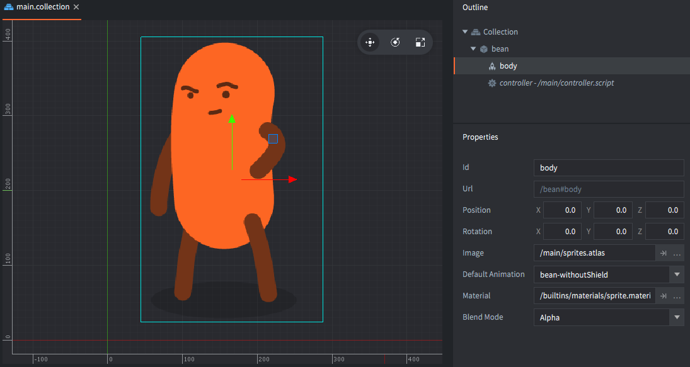
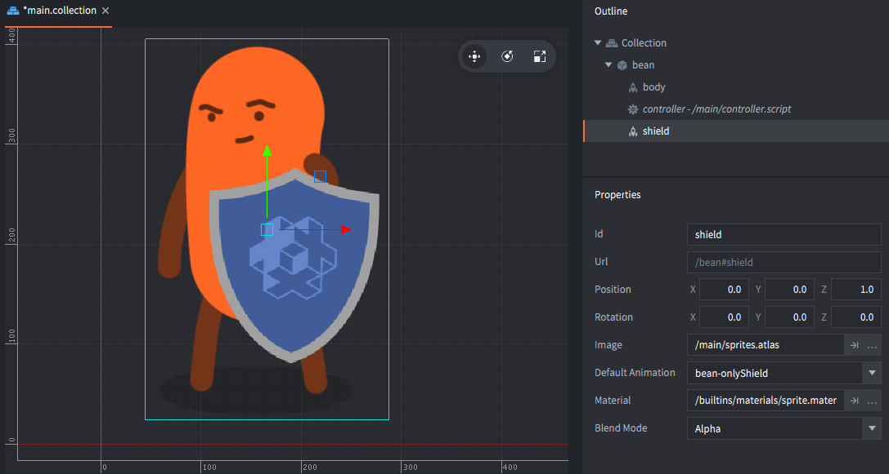

# 寻址

控制正在运行的游戏的代码必须能够到达每个对象和组件，以便移动，缩放，设置动画，删除和操纵玩家看到和听到的内容。 Defold 的寻址机制使之成为可能。

## 标识

Defold 使用地址（或URL，但现在暂时忽略它）来引用游戏对象和组件。 这些地址由标识符组成。 以下是 Defold 如何使用地址的所有示例。 通过本手册，我们将详细探讨它们如何工作：

```lua
local id = factory.create("#enemy_factory")
label.set_text("my_gameobject#my_label", "Hello World!")

local pos = go.get_position("my_gameobject")
go.set_position(pos, "/level/stuff/other_gameobject")

msg.post("#", "hello_there")
local id = go.get_id(".")
```

让我们从一个非常简单的示例开始。 假设您有一个带有单个精灵 component 的游戏对象。 您还具有脚本 component 来控制游戏对象。 编辑器中的设置如下所示：



现在，您想在游戏开始时禁用精灵，以便稍后使它出现。 通过将以下代码放入 "controller.script" 中，可以轻松完成此操作:

```lua
function init(self)
    msg.post("#body", "disable") -- <1>
end
```
1. 如果您对 '#' 字符感到困惑，请先不要担心。 我们稍后解释。

这将按预期工作。 游戏开始时，脚本组件通过其标识符 "body" 对子画面组件进行 “寻址”，并使用该地址向其发送带有 "disable" 的 "message" 消息。 该特殊引擎消息的作用是精灵组件隐藏了精灵图形。 从示意图上看，设置如下所示:


设置中的标识符是任意的。 在这里，我们选择给 game object 一个标识符 "bean"，它的精灵 component 被命名为 "body"，而控制角色的脚本 component 被命名为 “controller”。

::: sidenote
如果不选择名称，编辑器将选择。 每当您在编辑器中创建新的 game object 或 component 时，都会自动设置唯一的 *Id* 属性。

- Game objects 会通过枚举器自动获得一个名为 "go" 的 ID（"go2", "go3"等）。
- Components 获得与 component 类型相对应的 ID（"sprite", "sprite2" 等）。

您可以根据需要使用这些自动分配的名称，但是我们建议您将标识符更改为更具有描述性的名称。
:::

现在，让我们添加另一个 sprite component，并给 bean 提供盾牌:



新 component 必须在 game object 中唯一标识。 如果您将其命名为 "body"，则脚本代码对于应该发送 "disable" 消息的精灵将不明确。 因此，我们选择唯一的（和描述性的）标识符 "shield"。 现在，我们可以随意启用和禁用 "body" 和 "shield" 精灵。


::: sidenote
如果您确实尝试重复使用标识符，那么编辑器将发出错误信号，因此实际工作中这绝不是问题：


:::

现在，让我们看看如果添加更多 game objects 会发生什么。 假设您要将两个 "beans" 配对成一个小团队。 您决定将其中一个 bean game object 称为 "bean"，将另一个称为 "buddy"。 此外，当 "bean" 闲置了一段时间后，应该告诉 "buddy" 开始跳舞。 这是通过从 "bean" 中的 "controller" 脚本 component 向“好友”中的 "controller" 脚本发送自定义消息 "dance" 来完成的:


::: sidenote
有两个单独的组件，都称为 "controller"，每个 game object 一个，但是由于每个 game object 都创建了一个新的命名上下文，因此这是完全合法的。
:::

由于消息的接收者位于发送消息的游戏对象之外 ("bean")，因此代码需要指定哪个 "controller" 应接收消息。 它需要同时指定目标 game object id 和 component id。 component 的完整地址变为 `"buddy#controller"`，该地址由两个独立的部分组成。

- 先是目标 game object 的标识符 id ("buddy"),
- 随后是 game object/component 分割字符 ("#"),
- 最后是目标 component 的 id ("controller").

回到上一个示例，其中只有一个 game object，我们看到，通过省略目标地址中的 game object 标识符部分，代码可以对 *当前游戏对象* 中的组件进行寻址。

例如, `"#body"` 表示在当前 game object 中 id 为 "body" 的 component. 这很方便因为这个编码可以在 *任何* game object 内工作良好,只要 "body" component 确实存在.

## Collections

Collections makes it possible to create groups, or hierarchies, of game objects and reuse them in a controlled way. You use collection files as templates (or "prototypes" or "prefabs") in the editor when you populate your game with content.

Suppose that you want to create a great number of bean/buddy teams. A good way to do that is to create a template in a new *collection file* (name it "team.collection"). Build the team game objects in the collection file and save it. Then put an instance of that collection file's contents in your main bootstrap collection and give the instance an identifier (name it "team_1"):


With this structure, the "bean" game object can still refer to the "controller" component in "buddy" by the address `"buddy#controller"`.


And if you add a second instance of "team.collection" (name it "team_2"), the code running inside the "team_2" script components will work just as well. The "bean" game object instance from collection "team_2" can still address the "controller" component in "buddy" by the address `"buddy#controller"`.


## Collections

Collections 使创建 create groups 的组或层次结构并以受控方式重用它们成为可能。 当您用内容填充游戏时，可以在编辑器中将 collection 文件用作模板（或 "原型" 或 "预制件"）。

假设您要创建大量的 bean/buddy 团队。 这样做的一个好方法是在新的 *collection文件* 中创建一个模板（将其命名为 "team.collection"）。 在 collection 文件中构建团队游戏对象并保存。 然后将该 collection 文件内容的一个实例放入您的主引导 collection 中，并为该实例指定一个 id（将其命名为 "team_1"):


使用这种结构, "bean" game object 仍然可以通过地址 `"buddy#controller"` 访问 "buddy" 中的 "controller" component.


并且，如果您添加 "team.collection" 的第二个实例（将其命名为 "team_2"），则在 "team_2" 脚本 component 内部运行的代码也将正常工作。 集合 "team_2" 中的 "bean" game object 实例仍可以通过地址 `"buddy＃controller"` 访问“ buddy”中的 "controller" 组件。


## Relative addressing

The address `"buddy#controller"` works for the game objects in both collections because it is a *relative* address. Each of the collections "team_1" and "team_2" creates a new naming context, or "namespace" if you will. Defold avoids naming collisions by taking the naming context a collection creates into consideration for addressing:


- Within the naming context "team_1", the game objects "bean" and "buddy" are uniquely identified.
- Similarly, within the naming context "team_2", the game objects "bean" and "buddy" are also uniquely identified.

Relative addressing works by automatically prepending the current naming context when resolving a target address. This is again immensely useful and powerful because you can create groups of game objects with code and reuse those efficiently throughout the game.

Shorthands
: Defold provides two useful relative address shorthands:

  `.`
  : Shorthand resolving to the current game object.

  `#`
  : Shorthand resolving to the current component.

  For example:

  ```lua
   -- Let this game object acquire input focus
   msg.post(".", "acquire_input_focus")
  ```

  ```lua
   -- Post "reset" to the current script
   msg.post("#", "reset")
  ```


## 相对寻址

地址 `"buddy#controller"` 适用于两个 collections 中的 game objects，因为它是一个 “相对” 地址。 每个集合 "team_1" 和 "team_2" 都会创建一个新的命名上下文，或者如果您愿意的话，或叫 “命名空间”。 Defold 通过考虑集合创建的命名上下文来避免命名冲突，以解决以下问题：


- 在命名上下文 "team_1" 中, game objects "bean" 和 "buddy" 是唯一的标识符.
- 同样地, 在命名上下文 "team_2" 中, game objects "bean" 和 "buddy" 同样是唯一的标识符.

相对寻址通过在解析目标地址时自动在当前命名上下文之前添加前缀来实现。 这又是非常有用和强大的，因为您可以使用代码创建 game objects 组，并在整个游戏中高效地重复使用这些对象。

简写
: Defold 提供了以下两种游泳的相对地址简写:

  `.`
  : 解析到当前 game object.

  `#`
  : 解析到当前 component.

  For example:

  ```lua
   -- Let this game object acquire input focus
   msg.post(".", "acquire_input_focus")
  ```

  ```lua
   -- Post "reset" to the current script
   msg.post("#", "reset")
  ```

## Game object paths

To correctly understand the naming mechanism, let's look at what happens when you build and run the project:

1. The editor reads the bootstrap collection ("main.collection") and all its content (game objects and other collections).
2. For each static game object, the compiler creates an identifier. These are built as "paths" starting at the bootstrap root, down the collection hierarchy to the object. A '/' character is added at each level.

For our example above, the game will run with the following 4 game objects:

- /team_1/bean
- /team_1/buddy
- /team_2/bean
- /team_2/buddy

::: sidenote
Identities are stored as hashed values. The runtime also stores the hash state for each collection identity which is used to continue hashing relative string to an absolute id.
:::

In runtime, the collection grouping does not exist. There is no way to find out what collection a specific game object belonged to before compilation. Nor is it possible to manipulate all the objects in a collection at once. If you need to do such operations, you can easily do the tracking yourself in code. Each object's identifier is static, it is guaranteed to stay fixed throughout the object's lifetime. This means that you can safely store the identity of an object and use it later.

## Game object 路径

为了正确理解命名机制，让我们看一下在构建和运行项目时会发生什么:

1. 编辑器读取引导 collection（"main.collection"）及其所有内容（game objects 和其他 collections）。
2. 对于每个静态 game object，编译器都会创建一个标识符。 这些被构建为“路径”，从引导根开始，一直到 collection 层次结构到对象。 在每个级别添加一个 “/” 字符。 

对于上面的例子, 游戏将使用以下 4 个 game objects:

- /team_1/bean
- /team_1/buddy
- /team_2/bean
- /team_2/buddy

::: sidenote
标识符存储为 hash 值。 运行时还存储每个 collection 标识的哈希状态，该状态用于继续将相对字符串哈希到绝对 ID。
:::

在运行时，collection 分组不存在。 在编译之前，无法找到特定 game object 所属的 collection。 也不可能一次操纵 collection 中的所有对象。 如果需要执行此类操作，则可以简单地在代码中进行跟踪。 每个对象的标识符都是静态的，因此可以保证在对象的整个生命周期中保持不变。 这意味着您可以安全地存储对象的标识并在以后使用。

## Absolute addressing

It is possible to use the full identifiers described above when addressing. In most cases relative addressing is preferred since it allows for content reuse, but there are cases where absolutely addressing becomes necessary.

For example, suppose that you want an AI manager that tracks the state of each bean object. You want beans to report to their active status to the manager, and the manager makes tactical decisions and gives orders to the beans based on their status. It would make perfect sense in this case to create a single manager game object with a script component and place that alongside the team collections in the bootstrap collection.


Each bean is then responsible for sending status messages to the manager: "contact" if it spots an enemy or "ouch!" if it is hit and takes damage. For this to work, the bean controller scrips use absolute addressing to send messages to the component "controller" in "manager".

Any address that starts with a '/' will be resolved from the root of the game world. This corresponds to the root of the *bootstrap collection* that is loaded on game start.

The absolute address of the manager script is `"/manager#controller"` and this absolute address will resolve to the right component no matter where it is used.


## 绝对寻址

寻址时可以使用上述完整标识符。 在大多数情况下，相对寻址是首选方法，因为它允许内容重用，但是在某些情况下，绝对寻址变得很有必要。

例如，假设您需要一个 AI manager 来跟踪每个 bean 对象的状态。 您希望 bean 向 manager 报告其活动状态，然后 manager 做出战术决策并根据其状态向 bean 下达命令。 在这种情况下，创建一个 manager game object 带一个脚本 component，并将其放置在 bootstrap collection 中的 team collection 中，将是非常有意义的。


然后，每个 bean 负责向 manager 发送状态消息：如果发现敌人则 "contact"。 如果被击中并造成伤害则 "ouch!"。 为此，Bean 控制脚本使用绝对寻址将消息发送到 "manager" 中的 component “控制器”。

任何以 “/” 开头的地址都将从游戏世界的根开始进行解析。 这对应于游戏开始时加载的 *bootstrap collection* 的根。

manager 脚本的绝对地址为 `"/manager#controller"`，并且无论在何处使用，该绝对地址都将解析为正确的 component。


## Hashed identifiers

The engine stores all identifiers as hashed values. All functions that take as argument a component or a game object accepts a string, hash or an URL object. We have seen how to use strings for addressing above.

When you get the identifier of a game object, the engine will always return an absolute path identifier that is hashed:

```lua
local my_id = go.get_id()
print(my_id) --> hash: [/path/to/the/object]

local spawned_id = factory.create("#some_factory")
print(spawned_id) --> hash: [/instance42]
```

You can use such an identifier in place of a string id, or construct one yourself. Note though that a hashed id corresponds to the path to the object, i.e. an absolute address:

::: sidenote
The reason relative addresses must be given as strings is because the engine will compute a new hash id based on the hash state of the current naming context (collection) with the given string added to the hash.
:::

```lua
local spawned_id = factory.create("#some_factory")
local pos = vmath.vector3(100, 100, 0)
go.set_position(pos, spawned_id)

local other_id = hash("/path/to/the/object")
go.set_position(pos, other_id)

-- This will not work! Relative addresses must be given as strings.
local relative_id = hash("my_object")
go.set_position(pos, relative_id)
```

## 哈希标识符

引擎将所有标识符存储为散列值。 以 component 或 game object 为参数的所有函数都接受字符串，哈希或 URL 对象。 我们已经看到了如何在上面使用字符串进行寻址。

当您获得 game object 的标识符时，引擎将始终返回经过哈希处理的绝对路径标识符：

```lua
local my_id = go.get_id()
print(my_id) --> hash: [/path/to/the/object]

local spawned_id = factory.create("#some_factory")
print(spawned_id) --> hash: [/instance42]
```

您可以使用这样的标识符代替字符串ID，也可以自己构造一个。 然而值得注意的是哈希ID对应于对象的路径，即绝对地址：

::: sidenote
必须将相对地址作为字符串给出的原因是，引擎将基于当前命名上下文（collection）的哈希状态（将给定的字符串添加到哈希中）来计算新的哈希 ID。
:::

```lua
local spawned_id = factory.create("#some_factory")
local pos = vmath.vector3(100, 100, 0)
go.set_position(pos, spawned_id)

local other_id = hash("/path/to/the/object")
go.set_position(pos, other_id)

-- This will not work! Relative addresses must be given as strings.
local relative_id = hash("my_object")
go.set_position(pos, relative_id)
```

## URLs

To complete the picture, let's look at the full format of Defold addresses: the URL.

An URL is an object, usually written as specially formatted strings. A generic URL consists of three parts:

`[socket:][path][#fragment]`

socket
: Identifies the game world of the target. This is important when working with [Collection Proxies](/manuals/collection-proxy) and is then used to identify the _dynamically loaded collection_.

path
: This part of the URL contains the full id of the target game object.

fragment
: The identity of the target component within the specified game object.

As we have seen above, you can leave out some, or most of this information in the majority of cases. You almost never need to specify the socket, and you often, but not always, have to specify the path. In those cases when you do need to address things in another game world then you need to specify the socket part of the URL. For instance, the full URL string for the "controller" script in the "manager" game object above is:

`"main:/manager#controller"`

and the buddy controller in team_2 is:

`"main:/team_2/buddy#controller"`

We can send messages to them:

```lua
-- Send "hello" to the manager script and team buddy bean
msg.post("main:/manager#controller", "hello_manager")
msg.post("main:/team_2/buddy#controller", "hello_buddy")
```

## URLs

为了完整介绍这个主题, 让我们看下 Defold 地址的完整格式: URL.

一个 URL 就是一个对象, 通常按指定的格式书写. 一个典型的 URL 包含三个部分

`[socket:][path][#fragment]`

socket
: 标识目标的游戏世界。 这在使用  [Collection Proxies](/manuals/collection-proxy) 时很重要，然后用于标识 _动态加载的collection_。

path
: URL 的此部分包含目标 game object 的完整 ID.

fragment
: 指定 game object 内目标 component 的标识。 The identity of the target component within the specified game object.

正如我们在上面看到的，在大多数情况下，您可以忽略部分或大部分信息。 您几乎不需要指定套接字，并且经常但并非总是必须指定路径。 在您确实需要寻址另一个游戏世界中的事物时，需要指定 URL 的套接字部分。 例如，上面 "manager" game object 中 "controller" 脚本的完整 URL 字符串为：

`"main:/manager#controller"`

team_2 中 buddy controller 的 URL 为 :

`"main:/team_2/buddy#controller"`

可以向他们发送消息:

```lua
-- Send "hello" to the manager script and team buddy bean
msg.post("main:/manager#controller", "hello_manager")
msg.post("main:/team_2/buddy#controller", "hello_buddy")
```

## 构造 URL 对象

URL 对象也可以通过 Lua 代码以编程的方式构造:

```lua
-- 根据字符串构造 URL object:
local my_url = msg.url("main:/manager#controller")
print(my_url) --> url: [main:/manager#controller]
print(my_url.socket) --> 786443 (internal numeric value)
print(my_url.path) --> hash: [/manager]
print(my_url.fragment) --> hash: [controller]

-- 根据参数构造 URL:
local my_url = msg.url("main", "/manager", "controller")
print(my_url) --> url: [main:/manager#controller]

-- Build from empty URL object:
local my_url = msg.url()
my_url.socket = "main" -- specify by valid name
my_url.path = hash("/manager") -- specify as string or hash
my_url.fragment = "controller" -- specify as string or hash

-- Post to target specified by URL
msg.post(my_url, "hello_manager!")
```
