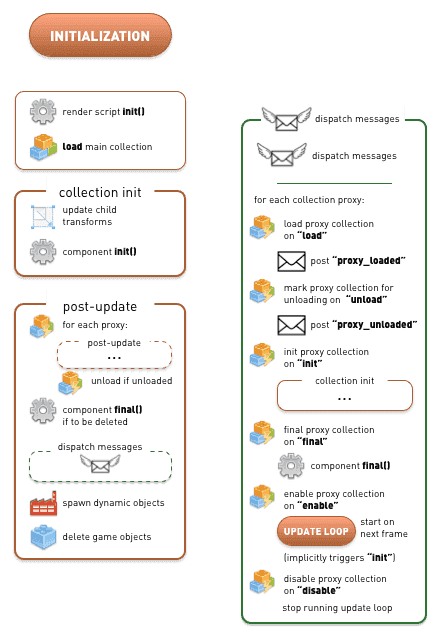

# 应用程序生命周期

Defold 应用程序或游戏的生命周期非常简单。引擎经历了三个执行阶段：初始化，更新循环（应用程序和游戏大部分时间都花在其中）和终结。


在许多情况下，对 Defold 的内部运作有基本的了解是有必要的。但是，您可能会遇到极端情况，在这些情况下，准确执行 Defold 的任务变得至关重要。本文档描述了引擎从头到尾如何运行应用程序.

该应用程序首先初始化运行引擎所需的所有内容。它加载主 collection，并在所有具有 `init()` 函数的已加载 components (脚本 components 和 带有 GUI 脚本的 GUI components )上调用 [`init()`](/ref/go#init)。这使您可以进行自定义初始化.

然后，应用程序进入更新循环，在该循环中，应用程序将花费其生命周期的大部分时间。每帧中，游戏对象及其包含的组件都会更新。任何脚本和 GUI 脚本的 [`update()`](/ref/go#update) 函数都将被调用。在更新循环期间，消息将分发给它们的接受者，并播放声音并渲染所有图形.

在某个时候，应用程序的生命周期将结束。在应用程序退出之前，引擎会退出更新循环并进入最终确定阶段。它准备删除所有已加载的游戏对象。调用了所有对象组件的 [`final()`](/ref/go#final) 函数，该函数允许自定义清除。然后删除对象，并卸载主 collection.

## 初始化

此图包含初始化步骤的详细细节。为了清楚起见，"dispatch messages" 传递中涉及的步骤（紧接在 "spawn dynamic objects" 之前）已置于右侧的单独块中.



在加载主 collection 之前，引擎实际上在初始化过程中采取了更多步骤。设置了内存探查器，套接字，图形，HID（输入设备），声音，物理等。应用程序配置 ("game.project") 也已加载并设置.

在引擎初始化结束时，第一个用户可控制的入口点是对当前渲染脚本的  `init()` 函数的调用.

然后加载主 collection 并进行初始化。collection 中的所有游戏对象都将其变换（平移（位置变化），旋转和缩放）应用于其子级。然后调用所有存在的组件 `init()` 函数.

::: sidenote
游戏对象组件 `init()`  函数的调用顺序是不确定的。您不应该假定引擎以某种顺序初始化属于同一集合的对象.
:::

由于您的 `init()` 代码可以发布新消息，告诉工厂生成新对象，将对象标记为删除并进行各种操作，因此引擎接下来将执行完整的 "post-update" 过程。此过程执行消息传递，实际的工厂游戏对象生成和对象删除。请注意，更新后传递包括 "dispatch messages"  序列，该序列不仅发送任何排队的消息，而且还处理发送到 collection proxies 的消息。在这些步骤中，将对代理进行任何后续更新（启用和禁用，加载和标记为卸载）.

研究上面的图可以发现，有可能在 `init()` 期间完全加载 [collection proxy](/manuals/collection-proxy)，确保所有包含的对象都已初始化，然后通过代理卸载 collection --- 所有这些操作发生在调用第一个组件 `update()` 之前，即在引擎离开初始化阶段并进入更新循环之前:

```lua
function init(self)
    print("init()")
    msg.post("#collectionproxy", "load")
end

function update(self, dt)
    -- The proxy collection is unloaded before this code is reached.
    print("update()")
end

function on_message(self, message_id, message, sender)
    if message_id == hash("proxy_loaded") then
        print("proxy_loaded. Init, enable and then unload.")
        msg.post("#collectionproxy", "init")
        msg.post("#collectionproxy", "enable")
        msg.post("#collectionproxy", "unload")
        -- The proxy collection objects’ init() and final() functions
        -- are called before we reach this object’s update()
    end
end
```

## 更新循环

更新循环每帧执行一次较长的序列。 为了清楚起见，下图中的更新序列分解为逻辑序列块。 出于相同的原因，"Dispatch messages" 也分开显示:


## 输入

从可用设备中读取输入，将其映射到 [input bindings](/manuals/input)，然后进行分派。 任何获得输入焦点的游戏对象都会将输入发送到其所有组件的 `on_input()` 函数。 带有脚本组件的游戏对象和带有GUI脚本的GUI组件将通过 `on_input()` 函数获得输入-前提是它们已定义且已获得输入焦点.

任何获得输入焦点并包含 collection proxy 组件的游戏对象都会将输入分发到代理集合内的组件。 该过程递归地向下进行.

## Update

遍历主集合中的每个游戏对象组件。如果这些组件中的任何一个具有脚本 `update()` 函数，则将调用该函数。如果组件是 collection proxy，则使用上图中 "update" 序列中的所有步骤以递归方式更新代理 collection 中的每个组件。

::: sidenote
游戏对象组件 `update()` 函数的调用顺序是不确定的。您不应假定引擎以特定顺序更新属于同一 collection 的对象.
:::

在下一步中，将分派所有已发布的消息。由于任何接收方组件的 `on_message()` 代码都可以发布新的消息，因此消息分发程序将继续分发已发布的消息，直到消息队列为空。但是，在消息分发程序执行的整个消息队列中运行的次数是有限制的。有关详细信息，请参见 [消息传递](/manuals/message-passing) 和 "Advanced topics" 部分.

对于碰撞对象组件，物理消息（碰撞，触发器，ray_cast 响应等）将在整个 game object 中分发到所有包含具有 `on_message()` 函数的脚本的组件

然后完成变换，将任何 game object 的移动，旋转和缩放应用于每个 game object 组件和任何子 game object 组件.

## 渲染更新

渲染更新块将消息调度到 `@render` 套接字（相机组件 `set_view_projection` 消息，`set_clear_color` 消息等）。 然后调用渲染脚本 `update()` 。

## 更新后

更新后，将运行更新后过程。它从标记为卸载的 collection proxies 内存中执行卸载（这在 "dispatch messages" 过程中发生）。任何标记为删除的游戏对象都会调用其所有组件的  `final()`  函数（如果有的话）。 “ `final()`  函数中的代码通常将新消息发布到队列中，因此此后将运行 "dispatch messages" 过程.

接下来，任何被告知生成游戏对象的工厂组件都将执行此操作。最后，标记为删除的游戏对象被删除.

更新循环的最后一步涉及调度 `@system` 消息（`exit`, `reboot` 消息，切换事件探查器状态，开始和停止视频捕获等）。然后渲染图形。在图形渲染期间，视频捕获以及可视分析器的任何渲染均已完成（请参见[调试文档](/manuals/debugging)。）

## 帧率和 collection 时间步长

可以在项目设置中设置每秒的帧更新次数（等于每秒执行更新循环的次数），也可以通过向 `@system` 套接字发送 `set_update_frequency` 消息来设置。 另外，可以通过向 collection proxies  发送 `set_time_step` 消息来为 collection proxies  单独设置 _时间步长_。 更改 collection 的时间步长不会影响帧速率。 它确实会影响物理更新时间步长以及传递给  `update()` 的 dt 变量。还要注意，更改时间步长不会改变每帧调用 `update()` 的次数- -它总是恰好一次。

(有关详细信息，请参见 [Collection proxy manual](/manuals/collection-proxy) 和 [`set_time_step`](/ref/collectionproxy#set-time-step))

## 终结

当应用程序退出时，它首先完成最后一个更新循环序列，这将卸载所有 collection proxies：终结并删除每个代理集合中的所有游戏对象

完成此操作后，引擎将输入一个处理主集合及其对象的终结过程：


首先调用组件的 `final()` 函数。 随后进行消息的分派。 最后，所有游戏对象均被删除，并且主 collection 被卸载。

引擎在幕后关闭子系统：删除项目配置，关闭内存探查器，依此类推。

现在，该应用程序已完全关闭。
