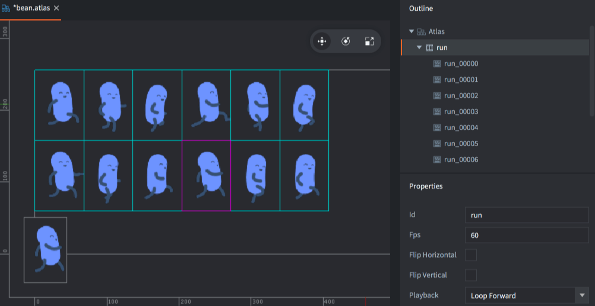
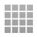
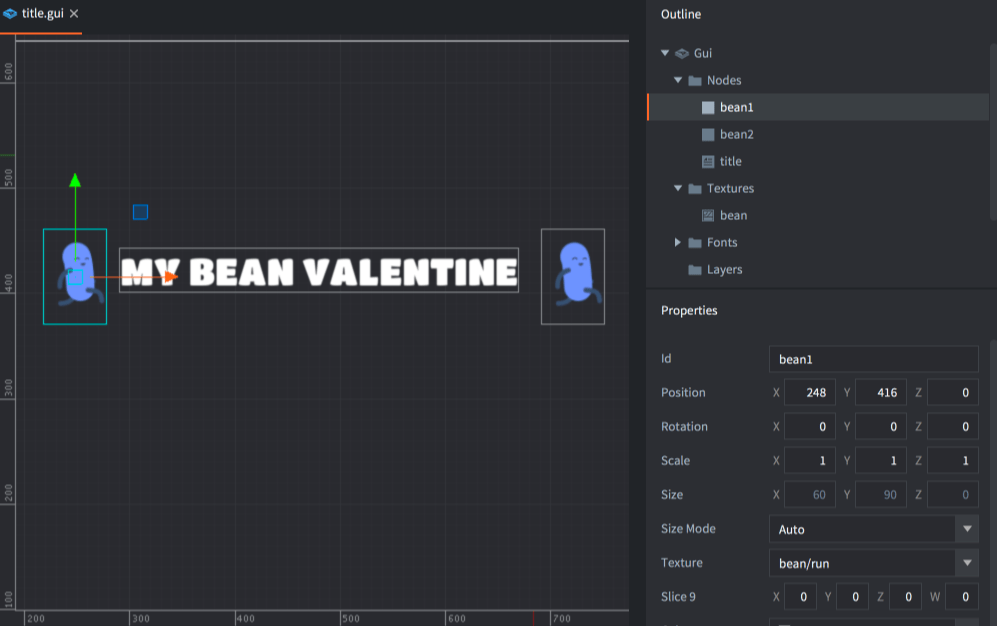

# 导入 2D 图像

Defold 支持多种 2D 游戏经常使用的可视 components. 你可以使用 Defold 创建静态的和动画精灵, UI components, 粒子特效, tile maps, 位图字体 和 Spine 动画. 在你创建这些可视化 components 之前你需要导入你要使用的图片文件. 要导入这些图片文件你只需要从你的计算机目录中拖动这些文件到 Defold 编辑器的 *Assets pane*.

{srcset="images/graphics/import@2x.png 2x"}

::: sidenote
Defold 支持 PNG 和 JPEG 格式的图片文件. 其他格式需要先转换为这两种格式之一.
:::

## Creating Defold assets

When the images are imported into Defold they can be used to create Defold specific assets:

{.icon} Atlas
: An atlas contains a list of separate images files, which are automatically combined into a larger texture image. Atlases can contain still images and *Animation Groups*, sets of images that together form a flipbook animation.

  {srcset="images/graphics/atlas@2x.png 2x"}

Learn more about the atlas resource in the [Atlas manual](/manuals/atlas).

{.icon} Tile Source
: A tile source references an image file that is already made out to consist of smaller sub-images ordered on a uniform grid. Another term commonly used for this type of compound image is _sprite sheet_. Tile sources can contain flipbook animations, defined by the first and last tile for the animation. It is also possible to use an image to automatically attach collision shapes to tiles.

  {srcset="images/graphics/tilesource@2x.png 2x"}

Learn more about the tile source resource in the [Tile source manual](/manuals/tilesource).

{.icon} Bitmap Font
: A bitmap font has its glyphs in a PNG font sheet. These types of fonts provide no performance improvement from fonts generated from TrueType or OpenType font files, but can include arbitrary graphics, coloring and shadows right in the image.

Learn more about bitmap fonts in the [Fonts manual](/manuals/font/#bitmap-bmfonts).

  {srcset="images/font/bm_font@2x.png 2x"}

## 创建 Defold 素材

当图片导入到 Defold 之后可以用它们创建特定的素材:

{.icon} 图集 Atlas
: 一个 atlas 包含一个单独的图片文件列表, 这些文件会自动组合成一个较大的纹理图像. 图集可以包含静态图像和 *动画组*, 即一组图片组合成一个翻页动画(帧动画:译者).

  {srcset="images/graphics/atlas@2x.png 2x"}

 查看 [Atlas manual](/manuals/atlas) 了解更多信息.

{.icon} 切片源 (Tile Source)
: 一个 tile source 引用一个图片文件, 该图片文件已经由统一网格上排序的较小的子图片组成. 另一个常用于这类复合图片的术语叫 _sprite sheet_. Tile sources 可包含翻页动画, 该动画由第一和最后一个 tile 定义. 也可以使用图片将碰撞形状自动附加到 tiles.

  {srcset="images/graphics/tilesource@2x.png 2x"}

查看 [Tile source manual](/manuals/tilesource) 了解更多信息.

{.icon} 位图字体 (Bitmap Font)
: 位图字体在 PNG 字体表中有其字形. 这种类型的字体相比从 TrueType 或 OpenType 生成的字体文件相比没有性能提升, 但可以包含任意的图形, 颜色和阴影.

查看 [Fonts manual](/manuals/font/#bitmap-bmfonts) 了解更多信息.

  {srcset="images/font/bm_font@2x.png 2x"}

## Using Defold assets

When you have converted the images into Atlas and Tile Source files you can use these to create several different kinds of visual components:

{.icon}
: A sprite is either a static image or flipbook animation that is displayed on screen.

  {srcset="images/graphics/sprite@2x.png 2x"}

Learn more about sprites in the [Sprite manual](/manuals/sprite).

{.icon} Tile map
: A tilemap component pieces together a map from tiles (image and collision shapes) that come from a tile source. Tile maps cannot use atlas sources.

  {srcset="images/graphics/tilemap@2x.png 2x"}

Learn more about tilemaps in the [Tilemap manual](/manuals/tilemap).

{.icon} Particle fx
: Particles that are spawned from a particle emitter consist of a still image or a flipbook animation from an atlas or tile source.

  {srcset="images/graphics/particles@2x.png 2x"}

Learn more about particle effects in the [Particle fx manual](/manuals/particlefx).

{.icon} GUI
: GUI box nodes and pie nodes can use still images and flipbook animations from atlases and tile sources.

  {srcset="images/graphics/gui@2x.png 2x"}

Learn more about GUIs in the [GUI manual](/manuals/gui).

{.icon} Spine model
: Spine models gets their data from Spine scene resources. Those contain two pieces of data:

  1. A Spine Json file that describes the bone animations.
  2. An atlas that contain the images that are attached to the bones. Spine models cannot use data from tile maps.

  {srcset="images/graphics/spine@2x.png 2x"}

Learn more about Spine models in the [Spine model manual](/manuals/spinemodel).

## 使用 Defold 素材

当你把图片转换为图集和切片源文件后你可以利用这些文件创建几种不同类型的可视 components:

{.icon}
: 精灵是显示在屏幕上的静态图片或翻页动画.

  {srcset="images/graphics/sprite@2x.png 2x"}

查看 [Sprite manual](/manuals/sprite) 了解更多信息.

{.icon} 平铺地图 (Tile map)
: 一个 tilemap component 是利用 tile source 中的 tile (图片 and 碰撞形状) 拼凑而成的地图  . Tile maps 不能使用 atlas 资源.

  {srcset="images/graphics/tilemap@2x.png 2x"}

查看 [Tilemap manual](/manuals/tilemap) 了解更多信息.

{.icon} 粒子特效 (Particle fx)
: 从粒子发射器产生的粒子来自静态图片或图集中的翻页动画或切片源.

  {srcset="images/graphics/particles@2x.png 2x"}

查看 [Particle fx manual](/manuals/particlefx) 了解更多信息.

{.icon} GUI
: GUI box 节点和 pie 节点 可以使用静态图片和图集和切片源中的翻页动画.

  {srcset="images/graphics/gui@2x.png 2x"}

查看 [GUI manual](/manuals/gui) 了解更多信息.

{.icon} Spine model
: Spine 模型从 Spine 场景资源中获取数据. 这些资源包含两个数据:

  1. 一个描述骨骼动画的 Spine Json 文件.
  2. 一个包含附加到骨骼的图片的图集. Spine 模型不能使用 tilemap 中的数据.

  {srcset="images/graphics/spine@2x.png 2x"}

查看 [Spine model manual](/manuals/spinemodel) 了解更多信息.