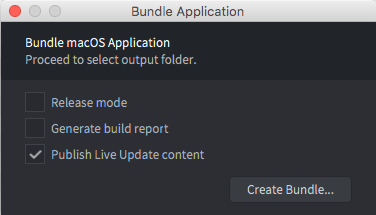
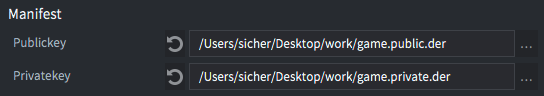
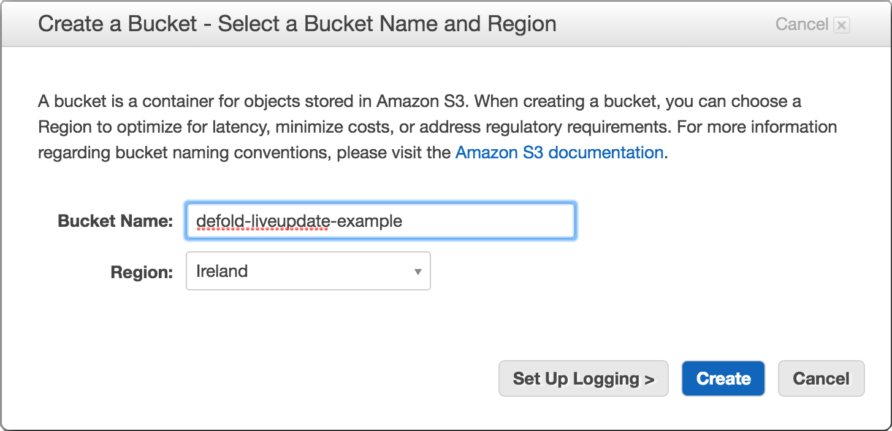
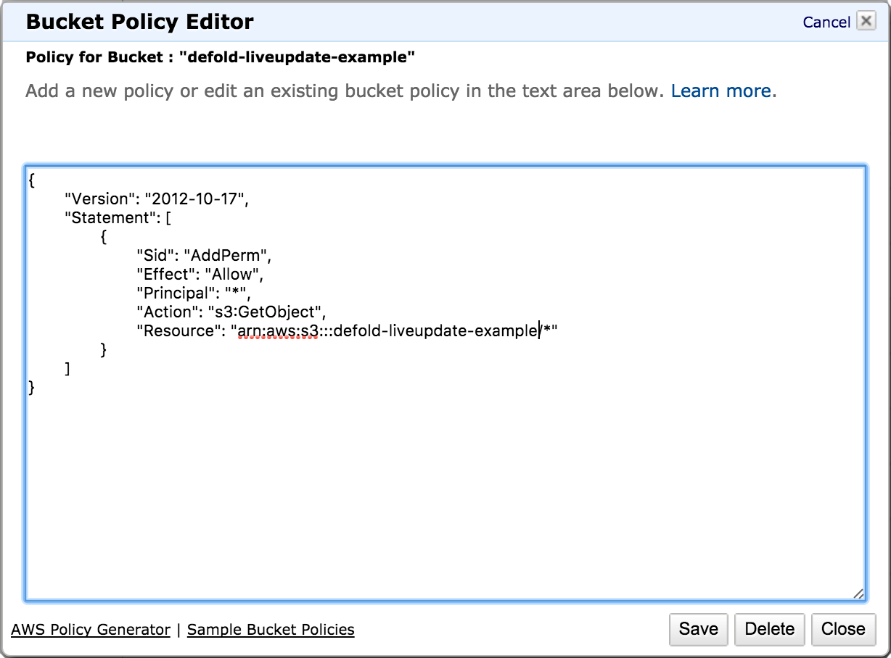
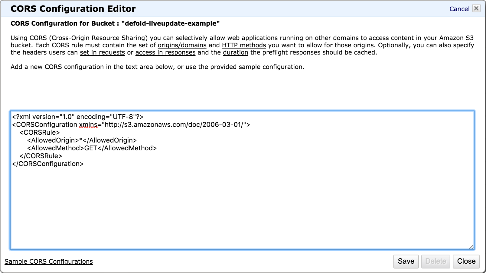
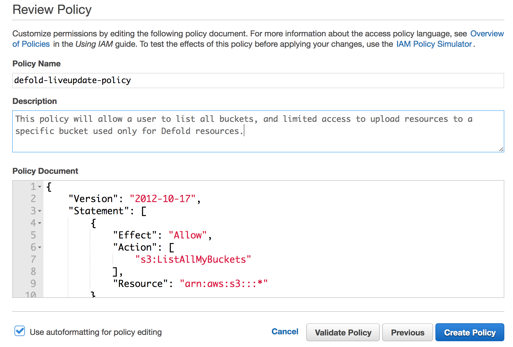
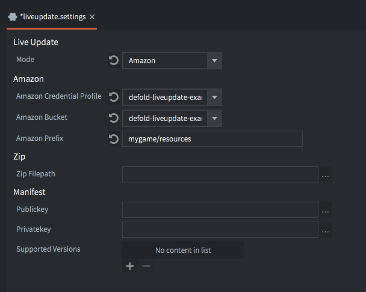
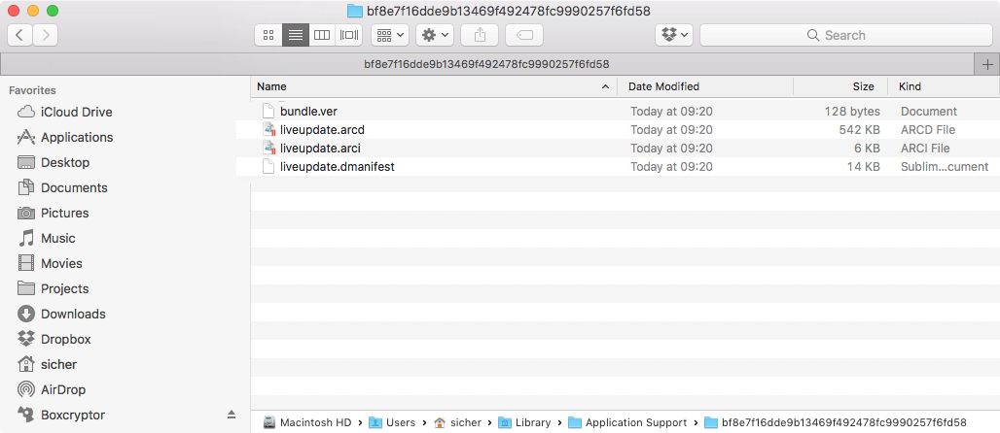

# Live update

When bundling a game, Defold packs all the game resources into the resulting platform specific package. In most cases this is preferred since the running engine has instant access to all resources and can load them swiftly from storage. However, there are instances where you might want to postpone the loading of resources to a later stage. For instance:

- Your game features a series of episodes and you wish to include only the first one for players to try out before they decide if they want to continue with the rest of the game.
- Your game is targeted for HTML5. On the browser, loading an application from storage means that the entire application package has to be downloaded before startup. On such a platform you may wish to send a minimal start package and get the app up and running quickly before you download the rest of the game resources.
- Your game contains very large resources (images, videos etc) that you wish to postpone the downloading of until they are about to show in the game. This is to keep the install size down.

The Live update functionality expands the concept of the collection proxy with a mechanism allowing the runtime to fetch and store resources to the application bundle that were intentionally left out of the bundle at build time.

# 实时更新

当捆绑一个游戏, Defold 会把所有游戏资源打包到特定的平台包中. 多数情况下这是首选的因为运行中的引擎可以即时的访问这些资源并且可以从存储中快速加载它们. 然而有时你可能想把资源的加载推迟到以后的某个阶段, 比如:

- 您的游戏具有一系列情节，并且您希望只包含第一个情节供玩家尝试，然后再决定是否要继续游戏的其余部分。
- 您的游戏针对HTML5。 在浏览器上，从存储中加载应用程序意味着必须在启动之前下载整个应用程序包。 在这样的平台上，您可能希望发送最少的启动包，并在下载其余游戏资源之前快速启动并运行该应用程序。
- 您的游戏包含非常大的资源（图像，视频等），希望将其下载推迟到游戏中显示。 这是为了减小安装尺寸。

实时更新功能通过一种机制扩展了集合代理(collection proxies)的概念，该机制允许运行时将在构建时有意不打包到软件中的资源提取并存储到应用捆绑软件中。

## 准备实时更新的内容

假设我们正在制作包含大型高分辨率图像资源的游戏。 游戏使用游戏对象将这些图像保存在包含 game object 和 sprite 的 collection 中，并将图像包含在 sprite 中:


要使引擎动态加载这样的 collection，我们可以简单地添加一个 collection proxy component 并将其指向* monalisa.collection *。 现在，游戏可以通过向 collection proxy 发送 `load` 消息来选择何时将 collection 中的内容从存储中加载到内存中。 但是，我们想走得更远，自己控制 collection 中包含的资源的加载。

这是通过简单地选中 collection proxy 属性中的 *Exclude* 复选框来完成的，告诉捆绑程序在创建应用程序捆绑包时将 *monalisa.collection* 中的所有内容都排除在外。


## Live update settings

When the bundler creates an application bundle it needs to store any excluded resources somewhere. The project settings for Live update govern the location for those resources. The settings are found under <kbd>Project ▸ Live update Settings...</kbd>. This will create a settings file if none exists. In `game.project`, select which liveupdate settings file to use when bundling. This allows for using different liveupdate settings for different environments, for example for live, QA, dev etc.


There are currently two ways that Defold can store the resources. Choose the method in the *Mode* dropdown in the settings window:

`Amazon`
: This option tells Defold to automatically upload excluded resources to an Amazon Web Service (AWS) S3 bucket. Fill in your AWS *Credential profile* name, select the appropriate *Bucket* and provide a *Prefix* name. [See below for details how to set up an AWS account](#setting_up_amazon_web_service).

`Zip`
: This option tells Defold to create a Zip archive file with any excluded resources. The archive is saved at the location specified in the *Export path* setting.

## 实时更新设置

捆绑程序创建应用程序程序时，它需要将所有排除的资源存储在某个位置。 实时更新的项目设置控制这些资源的位置。 这些设置位于<kbd>Project ▸ Live update Settings...</kbd>下。 如果不存在，将创建一个设置文件。 在 `game.project` 中，选择捆绑时要使用的liveupdate 设置文件。 这允许针对不同的环境（例如 live，QA，dev 等）使用不同的 liveupdate 设置。


Defold当前有两种存储资源的方式。 在设置窗口的 *Mode* 下拉菜单中选择方法：

`Amazon`
: 此选项告诉Defold自动将排除的资源上传到Amazon Web Service（AWS）S3存储桶。 填写您的AWS *Credential profile*名称，选择适当的 *Bucket* 并提供 *Prefix* 名称。[有关如何设置 AWS 账户的详细信息，请参见下文](#setting_up_amazon_web_service).

`Zip`
: 此选项告诉Defold使用任何排除的资源创建一个Zip存档文件。 归档文件保存在 *Export path* 设置中指定的位置。

## Scripting with excluded collection proxies

A collection proxy that has been excluded from bundling works as a normal collection proxy, with one important difference. Sending it a `load` message while it still has resources not available in the bundle storage will cause it to fail.

So before we send it a `load`, we need to check if there are any missing resources. If there are, we have to download them and then store them. The following example code assumes that the resources are stored on Amazon S3, in a bucket called "my-game-bucket" with the prefix `my-resources`.

```lua
function init(self)
    self.resources_pending = 0 -- <1>
    msg.post("#", "attempt_load_resources")
end

-- This function is called whenever we have tried to store a downloaded resource
-- necessary for our collection proxy to load.
local function resource_store_response(self, hexdigest, status)
    if status == true then
        -- Successfully loaded resource
        print("Resource data stored: " .. hexdigest)

        -- One less resource to go...
        self.resources_pending = self.resources_pending - 1

        -- That was all of them, time to load the proxied collection.
        if self.resources_pending == 0 then
            msg.post("#proxy", "load") -- <8>
        end
    else
        -- ERROR! Failed to store the data!
        print("Failed to store resource data: " .. hexdigest)
    end
end

function on_message(self, message_id, message, sender)
    if message_id == hash("attempt_load_resources") then
        local missing_resources = collectionproxy.missing_resources("#proxy") -- <2>

        -- initiate a download request for each of the missing resources that has not yet been tried.
        for _,resource_hash in ipairs(missing_resources) do
            msg.post("#", "attempt_download", { resource_hash = resource_hash})
        end

        self.resources_pending = #missing_resources -- <3>

        -- if we're running from editor all resources are there from the start.
        if self.resources_pending == 0 then
            msg.post("#proxy", "load")
        end
    elseif message_id == hash("attempt_download") then
        local manifest = resource.get_current_manifest() -- <4>
        local base_url = "https://my-game-bucket.s3.amazonaws.com/my-resources/" -- <5>
        http.request(base_url .. message.resource_hash, "GET", function(self, id, response)
            if response.status == 200 or response.status == 304 then -- <6>
                -- We got the response ok.
                print("storing " .. message.resource_hash)
                resource.store_resource(manifest, response.response, message.resource_hash, resource_store_response) -- <7>
            else
                -- ERROR! Failed to download resource!
                print("Failed to download resource: " .. message.resource_hash)
            end
        end)
    elseif message_id == hash("proxy_loaded") then
        msg.post(sender, "init")
        msg.post(sender, "enable")
    end
end
```
1. A simple counter that tells us how many resources we have still to download and store before we can load the proxy collection. Note that this code does not deal with errors at all so production code would need to do a better job at tracking the download and store operations.
2. Get any resources that we need to download and store.
3. Store the number of missing resources so we can count them down.
4. We need the current manifest since it lists all resources in the bundle, and if they are available or not.
5. We store our resources on Amazon S3. If you create a Zip archive with resources, you need to host the files somewhere and reference their location when downloading them with `http.request()`.
6. Amazon returns status 304 when files are cached.
7. We have data at this point. Try to store it.
8. Storage was successful and we have decreased the resource counter to zero. It is now safe to send a "load" message to the collection proxy. Note that if download or storage fails at some point, the counter will never reach zero.

With the loading code in place, we can test the application. However, running it from the editor will not download anything. This is because Live update is a bundle feature. When running in the editor environment no resources are ever excluded. To make sure everything works fine, we need to create a bundle.

## 使用排除的集合代理编写脚本

被排除在捆绑之外的 collection proxy 可以用作普通的 collection proxy，但有一个重要的区别。 在捆绑存储中仍然没有可用资源的情况下向其发送 `load` 消息将导致其失败。

因此，在我们发送一个 `load` 之前，我们需要检查是否缺少任何资源。 如果有，我们必须下载它们，然后将其存储。 以下示例代码假定资源存储在Amazon S3上的一个名为“ my-game-bucket”的存储桶中，其前缀为“ my-resources”。

```lua
function init(self)
    self.resources_pending = 0 -- <1>
    msg.post("#", "attempt_load_resources")
end

-- This function is called whenever we have tried to store a downloaded resource
-- necessary for our collection proxy to load.
local function resource_store_response(self, hexdigest, status)
    if status == true then
        -- Successfully loaded resource
        print("Resource data stored: " .. hexdigest)

        -- One less resource to go...
        self.resources_pending = self.resources_pending - 1

        -- That was all of them, time to load the proxied collection.
        if self.resources_pending == 0 then
            msg.post("#proxy", "load") -- <8>
        end
    else
        -- ERROR! Failed to store the data!
        print("Failed to store resource data: " .. hexdigest)
    end
end

function on_message(self, message_id, message, sender)
    if message_id == hash("attempt_load_resources") then
        local missing_resources = collectionproxy.missing_resources("#proxy") -- <2>

        -- initiate a download request for each of the missing resources that has not yet been tried.
        for _,resource_hash in ipairs(missing_resources) do
            msg.post("#", "attempt_download", { resource_hash = resource_hash})
        end

        self.resources_pending = #missing_resources -- <3>

        -- if we're running from editor all resources are there from the start.
        if self.resources_pending == 0 then
            msg.post("#proxy", "load")
        end
    elseif message_id == hash("attempt_download") then
        local manifest = resource.get_current_manifest() -- <4>
        local base_url = "https://my-game-bucket.s3.amazonaws.com/my-resources/" -- <5>
        http.request(base_url .. message.resource_hash, "GET", function(self, id, response)
            if response.status == 200 or response.status == 304 then -- <6>
                -- We got the response ok.
                print("storing " .. message.resource_hash)
                resource.store_resource(manifest, response.response, message.resource_hash, resource_store_response) -- <7>
            else
                -- ERROR! Failed to download resource!
                print("Failed to download resource: " .. message.resource_hash)
            end
        end)
    elseif message_id == hash("proxy_loaded") then
        msg.post(sender, "init")
        msg.post(sender, "enable")
    end
end
```
1. 一个简单的计数器，告诉我们在加载 collection proxy 之前仍需要下载和存储多少资源。请注意，此代码根本不处理错误，生产代码需要在跟踪下载和存储操作方面做得更好。
2. 获取我们需要下载和存储的所有资源。
3. 存储丢失的资源数量，以便我们可以减少它们的数量。
4. 我们需要当前 manifest，因为它列出了捆绑中的所有资源，以及它们是否可用。
5. 我们将资源存储在 Amazon S3 上。如果您使用资源创建一个 Zip 存档，则需要将文件托管在某个位置，并在通过 http.request() 下载它们时引用其位置。
6. 缓存文件时，Amazon返回状态304。
7. 我们现在有数据。尝试存储它。
8. 存储成功，并且我们将资源计数器减少为零。现在可以安全地向收集代理发送“加载”消息。请注意，如果下载或存储在某个时候失败，则计数器将永远不会达到零。

有了加载代码，我们就可以测试应用程序。但是，从编辑器运行它不会下载任何内容。这是因为实时更新是捆绑功能。在编辑器环境中运行时，永远不会排除任何资源。为了确保一切正常，我们需要创建一个捆绑包。

## 捆绑实时更新

捆绑实时更新很容易。 选择 <kbd>Project ▸ Bundle ▸ ...</kbd>，然后选择要为其创建应用程序捆绑包的平台。 这将打开捆绑对话框：



捆绑时，任何排除的资源都将被排除在应用程序捆绑之外。 通过选中 *Publish Live update content* 复选框，您可以告诉 Defold 将排除的资源上传到 Amazon 或创建一个 Zip 存档，具体取决于您如何设置实时更新设置（请参见上文）。 捆绑软件的 manifest 文件也将包含在排除的资源中。

单击 *Package*，然后选择应用程序捆绑包的位置。 现在，您可以启动应用程序，并检查一切是否按预期进行。

## The manifest

The manifest is an internal data structure that holds a list of all resources included in a build as well as the hash value of each resource. The Live update functionality uses the manifest to track what is part of the built game, list what can be loaded from external sources, and if that happens, make certain that the loaded data is intact.

From the user's perspective, the manifest is a numeric handle, leaving the details of how it's managed to the engine.

## The manifest

manifest 是一个内部数据结构，其中包含 build 中包含的所有资源的列表以及每个资源的哈希值。 实时更新功能使用 manifest 来跟踪内置游戏的内容，列出可以从外部源加载的内容，如果发生这种情况，确保加载的数据是完整的。

从用户的角度来看，manifest 是一个数字句柄，将如何管理的细节留给了引擎。

## Updating the manifest with Live update

With Live update a new manifest can be stored locally at runtime. The local manifest will be used at app startup instead of the one bundled with the application. This is useful for modifying or adding Live update resources to a published game that were not known at build time, without having to publish a full release.

When publishing Live update resources to either Amazon Web Service or to a zip archive, the manifest will be included in that package next to the resources. The name of the manifest file will be `liveupdate.game.dmanifest`.

Starting the engine for the first time after a manifest has been stored will create a bundle identifier file `bundle.ver` next to the manifest. This is used to detect whether the bundle has changed since the manifest was stored, for example after a full app store update. If this is the case the stored manifest will be deleted from the filesystem and the newer bundled manifest will be used instead. This means that a full app store update will delete any previously stored manifest. Any existing Live update resources will however remain untouched.

## 利用实时更新更新 manifest

使用实时更新，可以在运行时将新的 manifest 存储在本地。本地 manifest 将在应用启动时使用，而不是与应用捆绑在一起的 manifest。这对于在构建时不知道的实时修改已发布游戏的资源或向已发布游戏中添加实时更新资源很有用，而无需发布完整版本。

将实时更新资源发布到 Amazon Web Service 或 zip 存档时，manifest 将包含在资源的那个包中挨着资源。manifest 文件的名称为 `liveupdate.game.dmanifest`。

存储 manifest 后，第一次启动引擎将在 manifest 旁创建一个捆绑包标识符文件 `bundle.ver`。这用于检测自 manifest 存储以来捆绑包是否已更改，例如在完整的应用商店更新之后。如果是这种情况，将从文件系统中删除存储的 manifest，并使用较新的捆绑 manifest。这意味着完整的应用商店更新将删除任何以前存储的 manifest。但是，任何现有的实时更新资源都将保持不变。

### Manifest verification
When storing a new manifest the manifest data will be verified before it is actually written to disk. The verification consists of a number of checks:

* Correct binary file format.
* Supports the currently running engine version or any other supported version entry from the settings.
* Cryptographic signature.
* Signed using the same public-private key pair as the bundled manifest.
* Verify that all resources the manifest expects to be in the bundle actually are in the bundle.

From the user's perspective the verification process is completely opaque but it is important to note the steps involved to avoid the most common pitfalls.

### Manifest 验证
当存储新 manifest 时，manifest 数据将在实际写入磁盘之前进行验证。 验证包括许多检查：

* 正确的二进制文件格式。
* 支持当前运行的引擎版本或设置中任何其他受支持的版本条目。
* 密码签名。
* 使用与捆绑 manifest 相同的公私钥对签名。
* 确认 manifest 期望包含在捆绑中的所有资源实际上都在捆绑中。

从用户的角度来看，验证过程是完全透明的，但重要的是要注意所涉及的步骤，以避免最常见的陷阱。

### Supported engine versions
A manifest will always support the Defold version used when generating it. If you want to support any additional engine versions, add them to the list in the Live update settings. This can be useful if your live game uses a different Defold version than the one you are using to generate the manifest with.


### 支持的引擎版本
manifest 将始终支持生成它时使用的 Defold 版本。 如果要支持任何其他引擎版本，请将它们添加到实时更新设置的列表中。 如果您的游戏使用与用于生成清单的版本不同的 Defold 版本，这将很有用。


### Generating keys for signing
The manifest signature is used to verify that no one with malicious intent has tampered with the content, and that the bundled manifest and the new manifest were signed using the same keys. The signing is done as a part of the bundling process.
A public/private key pair is used to cryptographically sign the manifest. Signing uses 512/1024/2048-bit RSA keys in `.der`-format that the user needs to supply. You can generate these using the `openssl` tool:

```sh
$ openssl genrsa -out private_raw.key 1024
$ openssl pkcs8 -topk8 -inform pem -in private_raw.key -outform der -nocrypt -out private.der
$ openssl rsa -in private_raw.key -outform DER -RSAPublicKey_out -pubout -out public.der
```
This will output `private_raw.key` (can be safely deleted), `private.der`, and `public.der`. To use the keys for signing open the Live update settings view and point respective fields to the generated keys.



### 生成用于签名的密钥
manifest 签名用于验证没有人恶意意图篡改内容，以及捆绑的 manifest 和新 manifest 是否使用相同的密钥签名。 签名是捆绑过程的一部分。公钥/私钥对用于对 manifest 进行加密签名。 签名使用用户需要提供的 .der 格式的 512/1024/2048 位 RSA 密钥。 您可以使用 `openssl` 工具生成它们：

```sh
$ openssl genrsa -out private_raw.key 1024
$ openssl pkcs8 -topk8 -inform pem -in private_raw.key -outform der -nocrypt -out private.der
$ openssl rsa -in private_raw.key -outform DER -RSAPublicKey_out -pubout -out public.der
```
这将输出 `private_raw.key`（可以安全删除），`private.der` 和 `public.der`。 要使用密钥进行签名，请打开“实时更新设置”视图，并将各个字段指向生成的密钥。


### Scripting with Live update manifest
Adding to the scripting example above, we add the following callback function

```lua
local function store_manifest_cb(self, status)
    if status == resource.LIVEUPDATE_OK then
        print("Successfully stored manifest!")
    else
        print("Failed to store manifest, status: ", status)
    end
end
```

and the following to ```on_message``` to handle message ```attempt_download_manifest```:

```lua
...
elseif message_id == hash("attempt_download_manifest") then
    local base_url = "https://my-game-bucket.s3.amazonaws.com/my-resources/" -- <1>
    http.request(base_url .. MANIFEST_FILENAME, "GET", function(self, id, response)
        if response.status == 200 or response.status == 304 then
            -- We got the response ok.
            print("verifying and storing manifest " .. MANIFEST_FILENAME)
            resource.store_manifest(response.response, store_manifest_cb) -- <2>
        else
            -- ERROR! Failed to download manifest!
            print("Failed to download manifest: " .. MANIFEST_FILENAME)
        end
    end)
end
```
1. The manifest will be stored on S3 next to the rest of the Live update resources. As before, if you create a Zip archive with resources you need to host the files somewhere and reference their location when downloading them with `http.request()`.
2. Similar to how resources are downloaded and stored, the call to `resource.store_manifest` takes the downloaded manifest data and a callback as arguments. The function will verify the manifest and persist it to local storage.

If `resource.store_manifest` succeeds, the new manifest is now located in local storage. The next time the engine starts this manifest will be used instead of the one bundled with the game.


### 实时更新 manifest 脚本
在上面的脚本示例中，我们添加以下回调函数

```lua
local function store_manifest_cb(self, status)
    if status == resource.LIVEUPDATE_OK then
        print("Successfully stored manifest!")
    else
        print("Failed to store manifest, status: ", status)
    end
end
```

添加下面的 ```on_message``` 来处理消息 ```attempt_download_manifest```:

```lua
...
elseif message_id == hash("attempt_download_manifest") then
    local base_url = "https://my-game-bucket.s3.amazonaws.com/my-resources/" -- <1>
    http.request(base_url .. MANIFEST_FILENAME, "GET", function(self, id, response)
        if response.status == 200 or response.status == 304 then
            -- We got the response ok.
            print("verifying and storing manifest " .. MANIFEST_FILENAME)
            resource.store_manifest(response.response, store_manifest_cb) -- <2>
        else
            -- ERROR! Failed to download manifest!
            print("Failed to download manifest: " .. MANIFEST_FILENAME)
        end
    end)
end
```
1. manifest 将存储在 S3 上位于其他实时更新资源的旁边。 和以前一样，如果您使用资源创建一个 Zip 存档，则需要在 `http.request()` 下载文件前将文件托管并引用它们的位置。
2. 与资源的下载和存储类似，对 `resource.store_manifest` 的调用将下载的 manifest 数据和回调作为参数。 该功能将验证 manifest 并将其保存到本地存储中。

如果 `resource.store_manifest` 返回成功，则新 manifest 现在位于本地存储中。 引擎下次启动时，将使用此 manifest，而不是与游戏捆绑在一起的 manifest。

### Caveats
There are a few gotchas that might be good to know if you plan to use this feature to store a new manifest with Live update.

* It is only possible to add or modify resources referenced by collection proxies that are tagged as `Exclude` in the new manifest. No changes should be made to already bundled resources or resources not in excluded collection proxies. For example, doing changes in a script that is referenced by a bundled collection will cause the resource system to look for that resource in the bundled data archive. But since the shipped game bundle has not changed (only the manifest has) the changed script will not be found and consequently cannot be loaded.

* Even though this feature allows you to quickly push bug fixes or new features to a live game without doing a full app store release, it should be used with care. Pushing out a new manifest should involve the same processes as when doing a full release with everything that that entails (testing, QA, etc.).

### 注意事项
如果您打算使用此功能通过实时更新存储新 manifest，可能会有一些陷阱。

* 只能添加或修改被新 manifest 中标记为 `Exclude` 的 collection proxy 所引用的资源。 请勿对已捆绑的资源或 collection proxies 中未标记 `Exclude` 的资源进行更改。 例如，在捆绑 collection 中引用的脚本中进行更改将导致资源系统在捆绑数据归档中查找该资源。 但是，由于附带的游戏包没有更改（只有 manifest 更改了），因此找不到更改的脚本，因此无法加载。

* 即使使用此功能，您无需进行完整的应用商店发布，即可将漏洞修复或新功能快速推向实时游戏，但应谨慎使用。 推出新 manifest 应该包含与完全发布时所涉及的所有过程（测试，QA等）相同的过程。

## Setting up Amazon Web Service

To use the Defold Live update feature together with Amazon services you need an Amazon Web Services account. If you don't already have an account you can create one here https://aws.amazon.com/.

This section will explain how to create a new user with limited access on Amazon Web Services that can be used together with the Defold editor to automatically upload Live update resources when you bundle your game, as well as how to configure Amazon S3 to allow game clients to retrieve resources. For additional information about how you can configure Amazon S3, please see the [Amazon S3 documentation](http://docs.aws.amazon.com/AmazonS3/latest/dev/Welcome.html).

1. Create a bucket for Live update resources

    Open up the `Services` menu and select `S3` which is located under the _Storage_ category ([Amazon S3 Console](https://console.aws.amazon.com/s3)). You will see all your existing buckets together with the option to create a new bucket. Though it is possible to use an existing bucket, we recommend that you create a new bucket for Live update resources so that you can easily restrict access.

    

2. Add a bucket policy to your bucket

    Select the bucket you wish to use, open the *Properties* panel and expand the *Permissions* option within the panel. Open up the bucket policy by clicking on the *Add bucket policy* button. The bucket policy in this example will allow an anonymous user to retrieve files from the bucket, which will allow a game client to download the Live update resources that are required by the game. For additional information about bucket policies, please see [the Amazon documentation](https://docs.aws.amazon.com/AmazonS3/latest/dev/using-iam-policies.html).

    ```json
    {
        "Version": "2012-10-17",
        "Statement": [
            {
                "Sid": "AddPerm",
                "Effect": "Allow",
                "Principal": "*",
                "Action": "s3:GetObject",
                "Resource": "arn:aws:s3:::defold-liveupdate-example/*"
            }
        ]
    }
    ```

    

3. Add a CORS configuration to your bucket (Optional)

    [Cross-Origin Resource Sharing (CORS)](https://en.wikipedia.org/wiki/Cross-origin_resource_sharing) is a mechanism that allows a website to retrieve a resource from a different domain using JavaScript. If you intend to publish your game as an HTML5 client, you will need to add a CORS configuration to your bucket.

    Select the bucket you wish to use, open the *Properties* panel and expand the *Permissions* option within the panel. Open up the bucket policy by clicking on the *Add CORS Configuration* button. The configuration in this example will allow access from any website by specifying a wildcard domain, though it is possible to restrict this access further if you know on which domains you will make you game available. For additional information about Amazon CORS configuration, please see [the Amazon documentation](https://docs.aws.amazon.com/AmazonS3/latest/dev/cors.html).

    ```xml
    <?xml version="1.0" encoding="UTF-8"?>
    <CORSConfiguration xmlns="http://s3.amazonaws.com/doc/2006-03-01/">
        <CORSRule>
            <AllowedOrigin>*</AllowedOrigin>
            <AllowedMethod>GET</AllowedMethod>
        </CORSRule>
    </CORSConfiguration>
    ```

    

4. Create IAM policy

    Open up the *Services* menu and select *IAM* which is located under the _Security, Identity & Compliance_ category ([Amazon IAM Console](https://console.aws.amazon.com/iam)). Select *Policies* in the menu to the left and you will see all your existing policies together with the option to create a new policy.

    Click the button *Create Policy*, and then choose to _Create Your Own Policy_. The policy in this example will allow a user to list all buckets, which is only required when configuring a Defold project for Live update. It will also allow the user to get the Access Control List (ACL) and upload resources to the specific bucket used for Live update resources. For additional information about Amazon Identity and Access Management (IAM), please see [the Amazon documentation](http://docs.aws.amazon.com/IAM/latest/UserGuide/access.html).

    ```json
    {
        "Version": "2012-10-17",
        "Statement": [
            {
                "Effect": "Allow",
                "Action": [
                    "s3:ListAllMyBuckets"
                ],
                "Resource": "arn:aws:s3:::*"
            },
            {
                "Effect": "Allow",
                "Action": [
                    "s3:GetBucketAcl"
                ],
                "Resource": "arn:aws:s3:::defold-liveupdate-example"
            },
            {
                "Effect": "Allow",
                "Action": [
                    "s3:PutObject"
                ],
                "Resource": "arn:aws:s3:::defold-liveupdate-example/*"
            }
        ]
    }
    ```

    

5. Create a user for programmatic access

    Open up the *Services* menu and select *IAM* which is located under the _Security, Identity & Compliance_ category ([Amazon IAM Console](https://console.aws.amazon.com/iam)). Select *Users* in the menu to the left and you will see all your existing users together with the option to add a new user. Though it is possible to use an existing user, we recommend that you add a new user for Live update resources so that you can easily restrict access.

    Click the button *Add User*, provide a username and choose *Programmatic access* as *Access type*, then press *Next: Permissions*. Select *Attach existing policies directly* and choose the policy you created in step 4.

    When you've completed the process you will be provided with an *Access key ID* and a *Secret access key*.

    ::: important
    It is *very important* that you store those keys since you will not be able to retrieve them from Amazon after you leave the page.
    :::

6. Create a credentials profile file

    At this point you should have created a bucket, configured a bucket policy, added a CORS configuration, created a user policy and created a new user. The only thing that remains is to create a [credentials profile file](https://aws.amazon.com/blogs/security/a-new-and-standardized-way-to-manage-credentials-in-the-aws-sdks) so that the Defold editor can access the bucket on your behalf.

    Create a new directory *.aws* in your home folder, and create a file called *credentials* within the new directory.

    ```bash
    $ mkdir ~/.aws
    $ touch ~/.aws/credentials
    ```

    The file *~/.aws/credentials* will contain your credentials to access Amazon Web Services through programmatic access and is a standardised way to manage AWS credentials. Open the file in a text editor and enter your *Access key ID* and *Secret access key* in the format shown below.

    ```ini
    [defold-liveupdate-example]
    aws_access_key_id = <Access key ID>
    aws_secret_access_key = <Secret access key>
    ```

    The identifier specified within the brackets, in this example _defold-liveupdate-example_, is the same identifier that you should provide when configuring your project's Live update settings in the Defold editor.

    

## Development caveats

Debugging
: When running a bundled version of your game, you don't have direct access to a console. This causes problems for debugging. However, you can run the application from the command line or by double clicking the executable in the bundle directly:

  

  Now the game starts with a shell window that will output any `print()` statements:

  

Forcing re-download of resources
: When an application stores resources, they end up on disk on the local computer or handheld device. If you restart the application, the resources are there and ready. When developing you might want to remove resources and force the application to download them again.

  Defold creates a folder with the name of the hash of the created bundle on the device in the application support folder. If you delete the files in this folder, the application will invalidate the resources from the manifest and you can download and store them again.

  

  The location of the application support folder depends on the operating system. It can be found with `print(sys.get_save_file("", ""))`.

## 开发注意事项

Debugging
: 运行捆绑版本的游戏时，您无法直接访问控制台。 这会导致调试问题。 但是，您可以从命令行运行该应用程序，也可以直接在捆绑软件中双击可执行文件来运行该应用程序

  

  现在游戏在 shell 中启动并会输出 `print()` 语句内容:

  

强制重新下载资源包
: 当应用程序存储资源时，它们最终将存储在本地计算机或手持设备的磁盘上。 如果重新启动应用程序，则资源已准备就绪。 开发时，您可能希望删除资源并强制应用程序再次下载它们.

  Defold 在应用程序支持的路径中的创建一个文件夹，其中包含创建的捆绑包的哈希名称。 如果删除此文件夹中的文件，则应用程序将使 manifest 中的资源无效，您可以再次下载并存储它们.

  

  应用程序支持文件夹的位置取决于操作系统. 可以通过代码 `print(sys.get_save_file("", ""))` 来找到.
