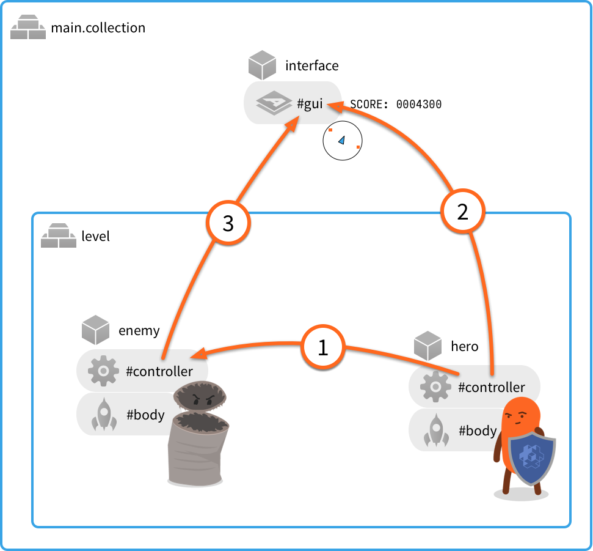
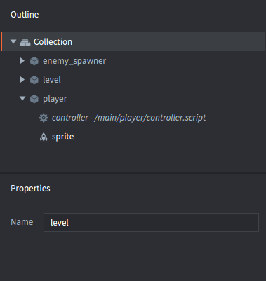

# 消息传递

消息传递是 Defold game objects 相互通信的一种机制。 本手册假定您对 Defold 的 [addressing mechanism](/manuals/addressing) 和 [basic building blocks](/manuals/building-blocks) 有基本的了解。

Defold 并不面向对象, 相比通过在对象（例如Java，C ++或C＃）中设置继承关系和成员函数的类层次结构来定义应用程序, Defold 通过简单而强大的面向对象设计扩展了 Lua，其中对象状态在脚本组件内部保留，可通过 `self` 引用进行访问。 此外，可以将对象与异步消息传递完全分离，以作为对象之间的通信手段。

## 用法示例

让我们首先看一些简单的用法示例。假设您要构建一个游戏，其中包括：


1. 一个主要的引导 collection，其中包含带有 GUI 组件的 game object（GUI 由小地图和分数计数器组成）。还有一个 ID 为 “level” 的 collection。
2. 名为 “关卡” 的 collection 包含两个 game objects：一个英雄角色和一个敌人。


::: sidenote
此示例的内容位于两个单独的文件中。主引导 collection 有一个文件，id 为 “level” 的 collection 有一个文件。但是，文件名在 Defold 中不重要。您分配实例的 id 才重要。
:::

游戏设计了一些简单的机制，需要在对象之间进行通信：



① 英雄攻击敌人
: 作为该机制的一部分，`"punch"`  消息从 “hero” 脚本 component 发送到 “enemy” 脚本 component。由于两个对象都位于 collection 层次结构中的同一位置，因此首选相对寻址:

  ```lua
  -- Send "punch" from the "hero" script to "enemy" script
  msg.post("enemy#controller", "punch")
  ```
  
  游戏中只是一次击打动作，因此该消息只需要包含其名称 “punch” 即可。
  
  在敌人的脚本 component 中，创建一个函数来接收消息：
  
  ```lua
  function on_message(self, message_id, message, sender)
    if message_id == hash("punch") then
      self.health = self.health - 100
    end
  end
  ```
  这样，代码仅查看消息的名称（在参数 `message_id` 中作为哈希字符串发送）。该代码既不关心消息数据，也不关心发送消息 "punch" 的发送者（任何人）会对可怜的敌人造成损害

② 英雄得分
: 每当玩家击败敌人时，玩家得分就会增加。还从 "hero" 游戏对象的脚本组件向 "interface" 游戏对象的 "gui" 组件发送 `"update_score"` 消息 

  ```lua
  -- Enemy defeated. Increase score counter by 100.
  self.score = self.score + 100
  msg.post("/interface#gui", "update_score", { score = self.score })
  ```

  在这种情况下，由于 "interface" 位于命名层次结构的根部，而 "hero" 则不是，因此无法写入相对地址。该消息将发送到已附加脚本的 GUI 组件，因此它可以对消息做出相应的反应。可以在脚本，GUI 脚本和渲染脚本之间自由发送消息。

  消息 `"update_score"` 与得分数据耦合。数据作为 Lua table 在 `message` 参数中传递：
  The message `"update_score"` is coupled with score data. The data is passed as a Lua table in the `message` parameter:

  ```lua
  function on_message(self, message_id, message, sender)
    if message_id == hash("update_score") then
      -- set the score counter to new score
      local score_node = gui.get_node("score")
      gui.set_text(score_node, "SCORE: " .. message.score)
    end
  end
  ```

③ 小地图上的敌人位置
: 玩家在屏幕上有一个小地图，可以帮助您定位和跟踪敌人。每个敌人可以通过向 "interface" 游戏对象中的 "gui" 组件发送 `"update_minimap"` 消息来发信号告知其位置

  ```lua
  -- Send the current position to update the interface minimap
  local pos = go.get_position()
  msg.post("/interface#gui", "update_minimap", { position = pos })
  ```

  GUI 脚本代码需要跟踪每个敌人的位置，如果同一敌人发送了新位置，则应替换旧位置。消息的发送者（通过参数 `sender` 传入）可用于索引保存位置的 lua table 的位置值.

  ```lua
  function init(self)
    self.minimap_positions = {}
  end

  local function update_minimap(self)
    for url, pos in pairs(self.minimap_positions) do
      -- update position on map
      ...
    end
  end

  function on_message(self, message_id, message, sender)
    if message_id == hash("update_score") then
      -- set the score counter to new score
      local score_node = gui.get_node("score")
      gui.set_text(score_node, "SCORE: " .. message.score)
    elseif message_id == hash("update_minimap") then
      -- update the minimap with new positions
      self.minimap_positions[sender] = message.position
      update_minimap(self)
    end
  end
  ```

## Sending messages

如上文所述，发送消息的机制非常简单。您调用函数 `msg.post()`，将您的消息发布到消息队列中。然后，引擎在每个帧中遍历队列，并将每个消息传递到其目标地址。对于某些系统消息（例如 “enable”，“disable”，“set_parent”等），引擎代码会处理该消息。引擎还会产生一些系统消息（例如有关物理碰撞的 “collision_response”），这些消息会传递给您的对象。对于发送到脚本组件的用户消息，该引擎仅调用名为`on_message()` 的特殊 Defold Lua 函数。

您可以将任意消息发送到任何现有的对象或组件，这取决于接收方的代码来响应消息。如果您将消息发送到脚本组件，并且脚本代码忽略了该消息，那也可以。处理消息的责任完全在接收端。

引擎将检查消息目标地址。如果您尝试向未知目的发送消息，Defold 将在控制台中发出错误消息：

```lua
-- 尝试发送到不存在的对象
msg.post("dont_exist#script", "hello")
```

```txt
ERROR:GAMEOBJECT: Instance '/dont_exists' could not be found when dispatching message 'hello' sent from main:/my_object#script
```

 `msg.post()` 函数的完整签名是:

`msg.post(receiver, message_id, [message])`

receiver
: 目标 component 或 game object 的ID。请注意，如果您以 game object 为目标，则消息将广播到 game object 中的所有component.

message_id
: 带有消息名称的字符串或哈希字符串.

[message]
: 可选的带有消息数据键值对的 Lua 表。消息 Lua 表中几乎可以包含任何类型的数据。您可以传递数字，字符串，布尔值，URL，哈希和嵌套表。您不能传递函数.

  ```lua
  -- 发送包含嵌套表的表数据
  local inventory_table = { sword = true, shield = true, bow = true, arrows = 9 }
  local stats = { score = 100, stars = 2, health = 4, inventory = inventory_table }
  msg.post("other_object#script", "set_stats", stats)
  ```

::: sidenote
消息参数表的大小有一个硬性限制。此限制设置为 2 KB。当前还没有一种简单的方法可以计算出表消耗的确切内存大小，但是您可以在插入表之前和之后使用  `collectgarbage("count")` 来监视内存使用情况.
:::

## 接收消息

接收消息是确保目标脚本组件包含名为 `on_message()` 的函数。该函数接受四个参数


`function on_message(self, message_id, message, sender)`

`self`
: 对脚本组件自身的引用.

`message_id`
: 包含消息的名称。名字是经过哈希的.

`message`
: 包含消息数据。这是一个 Lua 表。如果没有数据，则表为空.

`sender`
: 包含发送者的完整 URL.

```lua
function on_message(self, message_id, message, sender)
    print(message_id) --> hash: [my_message_name]

    pprint(message) --> {
                    -->   score = 100,
                    -->   value = "some string"
                    --> }
    
    print(sender) --> url: [main:/my_object#script]
end
```

## 游戏世界之间的消息传递

如果使用 collection proxy 组件将新的游戏世界加载到运行时，则可能需要在游戏世界之间传递消息。假设您已通过代理加载了一个 collection，并且该集合的 *Name* 属性设置为 “level”



一旦加载了 collection，初始化并启用，就可以通过在收件人地址 “socket” 字段中指定游戏世界名称，将消息发布到新世界中的任何组件或对象:

```lua
-- Send a message to the player in the new game world
msg.post("level:/player#controller", "wake_up")
```
有关代理如何工作的更深入的说明，请参见 [Collection Proxies](/manuals/collection-proxy).

## 消息链

当已发出的邮件最终到达时，将调用收件人的 `on_message()`。处理代码中再次发出新的消息（这些消息被添加到消息队列中）很常见.

当引擎开始调度时，它将遍历消息队列并调用每个消息接收者的  `on_message()`  函数，并持续进行直到消息队列为空。 如果调度阶段将新消息添加到队列中，它将进行另一阶段。 但是，对引擎尝试清空队列的次数有严格的限制，这实际上限制了可以预期在一个帧内完全调度多长时间的消息链。 您可以使用以下脚本轻松测试引擎在每个 `update()` 之间执行了多少次调度传递:

```lua
function init(self)
    -- 我们在对象初始化过程中开始了一条长消息链
    -- 并让它保持运行经过一系列 update() 调用.
    print("INIT")
    msg.post("#", "msg")
    self.updates = 0
    self.count = 0
end

function update(self, dt)
    if self.updates < 5 then
        self.updates = self.updates + 1
        print("UPDATE " .. self.updates)
        print(self.count .. " dispatch passes before this update.")
        self.count = 0
    end
end

function on_message(self, message_id, message, sender)
    if message_id == hash("msg") then
        self.count = self.count + 1
        msg.post("#", "msg")
    end
end
```

运行这个脚本将打印类似如下信息:

```txt
DEBUG:SCRIPT: INIT
INFO:ENGINE: Defold Engine 1.2.36 (5b5af21)
DEBUG:SCRIPT: UPDATE 1
DEBUG:SCRIPT: 10 dispatch passes before this update.
DEBUG:SCRIPT: UPDATE 2
DEBUG:SCRIPT: 75 dispatch passes before this update.
DEBUG:SCRIPT: UPDATE 3
DEBUG:SCRIPT: 75 dispatch passes before this update.
DEBUG:SCRIPT: UPDATE 4
DEBUG:SCRIPT: 75 dispatch passes before this update.
DEBUG:SCRIPT: UPDATE 5
DEBUG:SCRIPT: 75 dispatch passes before this update.
```

我们看到这个特定的 Defold 引擎版本在 `init()` 和首次调用 `update()` 之间的消息队列上执行了10次调度。 然后，它在每个后续更新循环中执行 75 次传递。
