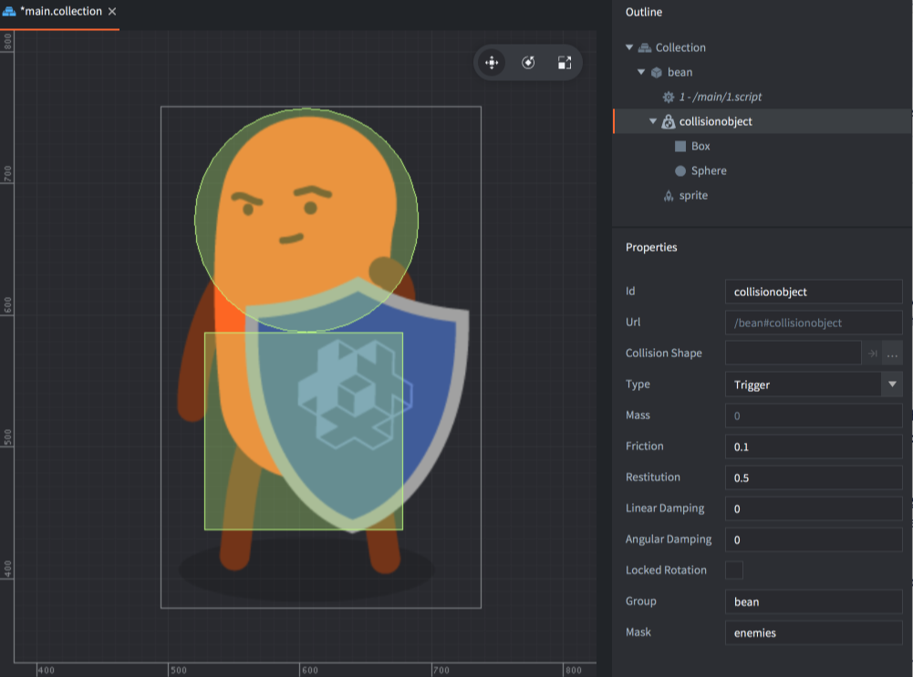
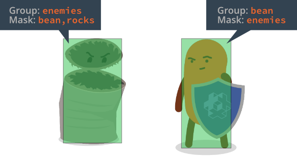
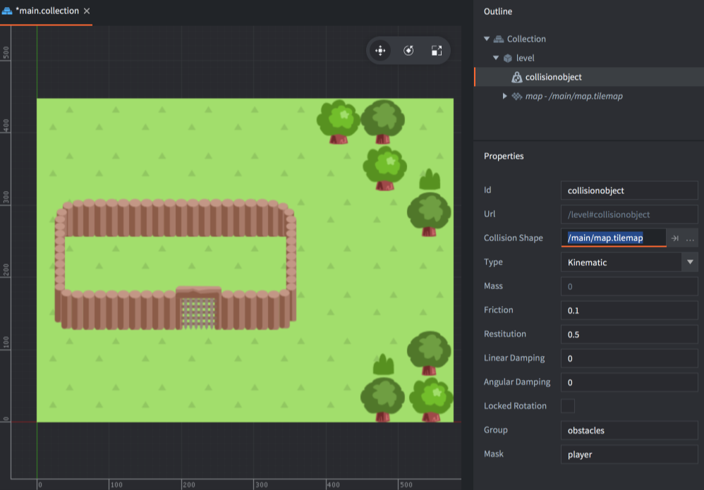
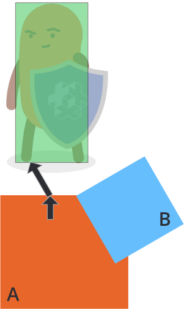

# Physics

Defold includes a modified version of the [Box2D](http://www.box2d.org) physics engine (version 2.1) for 2D physics simulations and the Bullet physics engine (version 2.77) for 3D physics. It allows you to simulate Newtonian physics interactions between different types of _collision objects_. This manual explains how this works.

# 物理

Defold 包含了一个经过修改的 [Box2D](http://www.box2d.org) 物理引擎 (version 2.1) 用来进行 2D 模拟和 Bullet 物理引擎 (version 2.77) 用来模拟 3D. 他们用来在各种不同的 _collision objects_ 间模拟符合牛顿运动定律的物理交互. 本篇将说明他们是如何工作的.

## Collision objects

A collision object is a component you use to give a game object physical behaviour. A collision object has physical properties like weight, restitution and friction and its spatial extension is defined by one or more _shapes_ that you attach to the component. Defold supports the following types of collision objects:

## 碰撞体

一个碰撞体是一个 component, 可以赋予一个 game object 以物理行为. 一个碰撞体具有像质量(weight), 碰撞和恢复(restitution and friction), 它所具有的空间属性是由附加在其上的一个或多个 _shapes_ 来定义的. Defold 支持如下几种碰撞体:

Static objects
: Static objects never move but a dynamic object that collides with a static object will react by bouncing and/or sliding. Static objects are very useful for building level geometry (i.e. ground and walls) that does not move. They are also cheaper performance-wise than dynamic objects. You cannot move or otherwise change static objects.

Static objects
: Static objects 不会运动,一个运动的碰撞体和一个 Static object 发生碰撞后将会反弹或滑行. Static objects 适合用来搭建关卡中地面和墙壁等不运动的物体. 它们比支持运动的碰撞体占用更少的资源. 你不能移动或以其他方式改变一个 Static object.

Dynamic objects
: Dynamic objects are simulated by the physics engine. The engine solves all collisions and applies resulting forces. Dynamic objects are good for objects that should behave realistically but you *cannot* directly manipulate the position and orientation of a dynamic object. The only way to affect them is indirectly, by applying forces.

Dynamic objects
: Dynamic objects 由物理引擎来模拟. 引擎来处理所有的碰撞和所产生的合力. Dynamic objects 适合用来模拟那些行为需要接近真实世界的物体但你不能直接设置一个 Dynamic object 的位置和方向. 唯一能影响一个 Dynamic object 行为的方法是给它一个作用力.

Kinematic objects
: Kinematic objects register collisions with other physics objects, but the physics engine do not perform any automatic simulation. The job of resolving collisions, or ignoring them, is left to you. Kinematic objects are very good for player or script controlled objects that require fine grained control of the physical reactions, like a player character.

Kinematic objects
: Kinematic objects 会记录与其他物理对象的碰撞,但是物理引擎不会执行任何自动模拟, 由你来决定处理碰撞或忽略它. 运动学对象非常适合需要精细控制身体反应的玩家或脚本控制的对象,例如玩家角色.

Triggers
: Triggers are objects that register simple collisions. They are good for objects that just need to register a hit (like a bullet) or as part of game logic where you want to trigger certain actions when an object reaches a specific point. Trigger are computationally cheaper than kinematic objects and should be used in favor of those if possible.

Triggers
: Triggers 是注册简单碰撞的对象. 它们对于只需要记录命中（例如子弹）或在游戏逻辑里当对象到达特定位置时,您想触发某些动作. Trigger 比 kinematic objects 需要更少的运算量，如果可能的话，应尽量使用它。

## Adding a collision object component

A collision object component has a set of *Properties* that sets its type and physics properties. It also contains one or more *Shapes* that define the whole shape of the physics object.

To add a collision object component to a game object:

1. In the *Outline* view, <kbd>right click</kbd> the game object and select <kbd>Add Component ▸ Collision Object</kbd> from the context menu. This creates a new component with no shapes.
2. <kbd>Right click</kbd> the new component and select <kbd>Add Shape ▸ Box / Capsule / Sphere</kbd>. This adds a new shape to the collision object component. You can add any number of shapes to the component.
3. Use the move, rotate and scale tools to edit the shapes.
4. Select the component in the *Outline* and edit the collision object's *Properties*.

## 添加一个碰撞体 component

一个碰撞体 component 有一组属性可用来设置它的类型和物理参数, 同时包含一个或多个形状参数用来定义碰撞体的形状.

要添加一个碰撞体 component 到一个 game object:

1. 在编辑器的 *Outline* 视图, <kbd>右击</kbd> game object 并从菜单中选择 <kbd>Add Component ▸ Collision Object</kbd>. 这将添加一个新的没有形状的碰撞体 component.
2. <kbd>右击</kbd> 刚添加的碰撞体 component 并选择 <kbd>Add Shape ▸ Box / Capsule / Sphere</kbd>. 这将为碰撞体 component 添加一个形状. 你可以给碰撞体添加多个形状.
3. 利用移动,旋转,缩放工具编辑这些形状.
4. 在 *Outline* 视图中选中碰撞体 component,可以编辑它的各种属性.

{srcset="images/physics/collision_object@2x.png 2x"}

Id
: The identity of the component.

Collision Shape
: This property is used for tile map geometry that does not use ordinary primitive shapes. See below for more information.

Type
: The type of collision object: `Dynamic`, `Kinematic`, `Static` or `Trigger`. If you set the object to dynamic you _must_ set the *Mass* property to a non zero value. For dynamic or static objects you should also check that the *Friction* and *Restitution* values are good for your use-case.

Friction
: Friction makes it possible for objects to slide realistically against each other. The friction value is usually set between `0` (no friction at all---a very slippery object) and `1` (strong friction---an abrasive object). However, any positive value is valid.

  The friction strength is proportional to the normal force (this is called Coulomb friction). When the friction force is computed between two shapes (`A` and `B`), the friction values of both objects are combined by the geometric mean:

  $$
  F_{combined} = \sqrt{ F_A \times F_B }
  $$

  This means that if one of the objects has zero friction then the contact between them will have zero friction.

Restitution
: The restitution value sets the "bounciness" of the object. The value is usually between 0 (inelastic collision—the object does not bounce at all) and 1 (perfectly elastic collision---the object's velocity will be exactly reflected in the bounce)

  Restitution values between two shapes (`A` and `B`) are combined using the following formula:

  $$
  R = \max{ \left( R_A, R_B \right) }
  $$

  When a shape develops multiple contacts, restitution is simulated approximately because Box2D uses an iterative solver. Box2D also uses inelastic collisions when the collision velocity is small to prevent bounce-jitter


Linear damping
: Linear damping reduces the linear velocity of the body. It is different from friction, which only occurs during contact, and can be used to give objects a floaty appearance, like they are moving through something thicker than air. Valid values are between 0 and 1.

  Box2D approximates damping for stability and performance. At small values, the damping effect is independent of the time step while at larger damping values, the damping effect varies with the time step. If you run your game with a fixed time step, this never becomes an issue.

Angular damping
: Angular damping works like linear damping but reduces the angular velocity of the body. Valid values are between 0 and 1.

Locked rotation
: Setting this property totally disables rotation on the collision object, no matter what forces are brought to it.

Group
: The name of the collison group the object should belong to. You can have 16 different groups and you name them as you see fit for your game. For example "players", "bullets", "enemies" and "world". If the *Collision Shape* is set to a tile map, this field is not used but the groups names are taken from the tile source.

Mask
: The other _groups_ this object should collide with. You can name one group or specify multiple groups in a comma separated list. If you leave the Mask field empty, the object will not collide with anything.

Id
: component ID.

Collision Shape
: 这个属性用于那些不使用普通图形的 tile map 块. 详情见后文.

Type
: 碰撞体类型: `Dynamic`, `Kinematic`, `Static` or `Trigger`. 如果你选择了 dynamic 那么必须设置 *Mass* 属性为一个非 0 值. 对于 dynamic 或者 static 类型也应该检查 *Friction* 和 *Restitution* 的值.

Friction
: 摩擦力能让物体间彼此产生滑动. 摩擦力的值通常设置为 `0` (完全没有摩擦力---一个非常光滑的物体) 到 `1` (强大的摩擦力---非常涩). 但是,任何值都是有效的.

  摩擦力大小和法向力成正比(称为库伦摩擦).当计算两个形状（“ A”和“ B”）之间的摩擦力时，两个对象的摩擦值将通过几何平均值进行组合:

  $$
  F_{combined} = \sqrt{ F_A \times F_B }
  $$

  这意味这如果其中一个物体的摩擦力为 0 那么和它接触的所有物体与其的摩擦力都为 0

Restitution
: 恢复 这个值用来设置物体的 "弹性". 通常值在 0 (无弹性) 到 1 (最有弹性---物体会原速反弹)

  使用以下公式组合两个物体 (`A` and `B`) 之间的恢复值:

  $$
  R = \max{ \left( R_A, R_B \right) }
  $$

  当形状形成多个接触时，由于Box2D使用迭代求解器，因此近似模拟了复原。 当碰撞速度较小时，Box2D还使用非弹性碰撞以防止反弹抖动.


Linear damping
: 线性阻尼会降低物体的线速度. 不像摩擦力仅作用于物体之间, 可用于使物体具有浮动的外观, 就像它们移动在比空气密度大的环境里. 有效值为 0 到 1.

  Box2D 粗略计算阻尼以提高稳定性和性能. 值较小时, 阻尼效果和时间步长无关; 值较大时, 阻尼效果随时间步长变化. 如果你的游戏以固定时间步长运行,这不会成为问题.

Angular damping
: 角阻尼就像线阻尼但用于降低物体的角速度. 有效值为 0 到 1.

Locked rotation
: 设置此属性将会完全禁用碰撞体旋转,无论它受到了什么力.

Group
: 碰撞体所属的碰撞组名称. 你可以拥有 16 个不同的组根据游戏内容给他们命名. 例如 "players", "bullets", "enemies" and "world". 如果 *碰撞形状* 设置为 tile map, 将不使用这个字段, 组名称将取自 tile source.

Mask
: 和物体产生碰撞的其他组. 可以输入一个组名或用逗号分开设置多个组名. 如果此项为空, 物体将不会和任何东西碰撞.

### Units used by the physics engine simulation

The physics engine simulates Newtonian physics and it is designed to work well with meters, kilograms and seconds (MKS) units. Furthermore, the physics engine is tuned to work well with moving objects of a size in the 0.1 to 10 meters range (static objects can be larger) and by default the engine treats 1 unit (pixel) as 1 meter. This conversion between pixels and meters is convenient on a simulation level, but from a game creation perspective it isn't very useful. With default settings a collision shape with a size of 200 pixels would be treated as having a size of 200 meters which is well outside of the recommended range, at least for a moving object. In general it is required that the physics simulation is scaled for it to work well with the typical size of objects in a game. The scale of the physics simulation can be changed in `game.project` via the [physics scale setting](/manuals/project-settings/#physics). Setting this value to for instance 0.02 would mean that 200 pixels would be treated as a 4 meters. Do note that the gravity (also changed in `game.project`) has to be increased to accommodate for the change in scale.

### 物理引擎模拟所使用的单位

物理引擎模拟牛顿物理学，并且设计为可以与米，千克和秒（MKS）单位一起很好地工作。此外，物理引擎已调整为可与尺寸在0.1到10米范围内的移动对象（静态对象可能更大）一起正常工作，并且默认情况下，引擎将1个单位（像素）视为1米。在模拟级别上，像素和米之间的这种转换很方便，但是从游戏创建的角度来看，它并不是很有用。使用默认设置时，至少对于移动物体，大小为200像素的碰撞形状将被视为大小超出建议范围的200米。通常，需要对物理模拟进行缩放，以使其能够与游戏中对象的典型大小很好地配合。可以通过[physics scale setting](/manuals/project-settings/#physics). 在`game.project`中更改物理模拟的比例。将此值设置为例如0.02意味着200像素将被视为4米。请注意，必须增加重力（也在`game.project`中更改）以适应比例的变化.

## Group and mask

The physics engine allows you to group your physics objects and filter how they should collide. This is handled by named _collision groups_. For each collision object you create two properties control how the object collides with other objects, *Group* and *Mask*.

For a collision between two objects to register both objects must mutually specify each other's groups in their *Mask* field.

{srcset="images/physics/collision_group@2x.png 2x"}

The *Mask* field can contain multiple group names, allowing for complex interaction scenarios.

## 分组和掩码

物理引擎允许你对物理对象分组和过滤来指定他们如何碰撞. 这是由叫 _collision groups_ 处理的. 对于没一个碰撞体你都可以设置两个属性来控制碰撞体之间如何碰撞, *Group* 和 *Mask*.

要在两个物体之间产生碰撞你必须在他们各自的 *Mask* 属性里设置上对方所属的组名

{srcset="images/physics/collision_group@2x.png 2x"}

*Mask* 域可含多个组名, 用于复杂的交互场景.

## Tilemap collision shapes

Defold includes a feature allowing you to easily generate physics shapes for a tile map. The [Tilemap manual](/manuals/tilemap/) explains how to add collision groups to a tile source and assign tiles to collision groups.

To add collision to a tile map:

1. Add the tilemap to a game object by <kbd>right-clicking</kbd> the game object and selecting <kbd>Add Component File</kbd>. Select the tile map file.
2. Add a collision object component to the game object by <kbd>right-clicking</kbd> the game object and selecting <kbd>Add Component ▸ Collision Object</kbd>.
3. Instead of adding shapes to the component, set the *Collision Shape* property to the *tilemap* file.
4. Set up the collision object component *Properties* as usual.

{srcset="images/physics/collision_tilemap@2x.png 2x"}

::: important
Note that the *Group* property is **not** used here since the collision groups are defined in the tile map's tile source.
:::

## Tilemap 的碰撞图形

Defold 允许你非常容易地为一个 tilemap 生成物理图形. 在[Tilemap manual](/manuals/tilemap/) 里解释了如何为一个 tilesource 添加碰撞组并把 tiles 设置为属于这些组.

为 tile map 添加碰撞:

1. 通过<kbd>右击</kbd> game object 选择 <kbd>Add Component File</kbd>, 然后选择 tile map 文件来为一个 game object 添加 tilemap.
2. 通过<kbd>右击</kbd> game object 选择 <kbd>Add Component ▸ Collision Object</kbd> 来为一个 game object 添加碰撞体 component.
3.无需向 component 添加形状, 设置它的 *Collision Shape* 属性为 *tilemap* 文件.
4. 设置碰撞体 component *属性*.

{srcset="images/physics/collision_tilemap@2x.png 2x"}

::: 重要
切记 *Group* 属性 **不**在这里设置因为碰撞体的组名在 tile map 的 tile source 里定义.
:::

## Collision messages

When two objects collide, the engine will broadcast messages to all components in both objects:

**`"collision_response"`**

This message is sent for all collision objects. It has the following fields set:

`other_id`
: the id of the instance the collision object collided with (`hash`)

`other_position`
: the world position of the instance the collision object collided with (`vector3`)

`other_group`
: the collision group of the other collision object (`hash`)

The collision_response message is only adequate to resolve collisions where you don't need any details on the actual intersection of the objects, for example if you want to detect if a bullet hits an enemy. There is only one of these messages sent for any colliding pair of objects each frame.

**`"contact_point_response"`**

This message is sent when one of the colliding objects is dynamic or kinematic. It has the following fields set:

`position`
: world position of the contact point (`vector3`).

`normal`
: normal in world space of the contact point, which points from the other object towards the current object (`vector3`).

`relative_velocity`
: the relative velocity of the collision object as observed from the other object (`vector3`).

`distance`
: the penetration distance between the objects -- non negative (`number`).

`applied_impulse`
: the impulse the contact resulted in (`number`).

`life_time`
: (*not currently used!*) life time of the contact (`number`).

`mass`
: the mass of the current collision object in kg (`number`).

`other_mass`
: the mass of the other collision object in kg (`number`).

`other_id`
: the id of the instance the collision object is in contact with (`hash`).

`other_position`
: the world position of the other collision object (`vector3`).

`group`
: the collision group of the other collision object (`hash`).

For a game or application where you need to separate objects perfectly, the `"contact_point_response"` message gives you all information you need. However, note that for any given collision pair, several `"contact_point_response"` messages can be received each frame, depending on the nature of the collision. See below for more information.

## 碰撞消息

当两个物体发生碰撞时,引擎会向两个物体的所有 components 里广播消息:

**`"collision_response"`**

这条消息向所有碰撞体发送, 有以下字段:

`other_id`
: 碰撞时对方碰撞体的实例 id (`hash`)

`other_position`
: 对方碰撞体实例在 world 的位置 (`vector3`)

`other_group`
: 对方所属的碰撞组(`hash`)

collision_response 消息适用于你不必关心物体具体交点这些详细信息的碰撞处理,比如你想检测一发子弹是否击中了敌人.每帧中每对发生碰撞的碰撞体该消息只发送一次

**`"contact_point_response"`**

此消息当碰撞的对象中有一个类型是 dynamic 或 kinematic 时发送, 携带以下字段信息:

`position`
: 接触点的世界坐标 (`vector3`).

`normal`
: 接触点的世界空间的法线, 从另一个物体指向当前对象 (`vector3`).

`relative_velocity`
: 以另一个点为参考的当前碰撞体的相对速度 (`vector3`).

`distance`
: 物体之间的穿透距离 -- 非负值 (`number`).

`applied_impulse`
: 碰撞产生的冲击力 (`number`).

`life_time`
: (*未使用!*) 碰撞生命周期 (`number`).

`mass`
: 当前碰撞体质量, 单位 kg (`number`).

`other_mass`
: 对方碰撞体质量, 单位 kg (`number`).

`other_id`
: 对方碰撞体实例 ID (`hash`).

`other_position`
: 对方碰撞体实例的世界坐标 (`vector3`).

`group`
: 对方碰撞体所属的组 (`hash`).

当有必要完美单独处理每个对象的时候, `"contact_point_response"` 消息能提供所有必要的信息, 但是对于没对碰撞对象, 每帧都会收到若干个 `"contact_point_response"` 消息, 这取决于碰撞的特性. 下文会有更多信息.

## Trigger messages

Triggers are light weight collision objects. Thay are similar to ray casts in that they read the physics world as opposed to interacting with it.

In a trigger collision `"collision_response"` messages are sent. In addition, triggers also send a special `"trigger_response"` message when the collision begins and end. The message has the following fields:

`other_id`
: the id of the instance the collision object collided with (`hash`).

`enter`
: `true` if the interaction was an entry into the trigger, `false` if it was an exit. (`boolean`).

## Trigger 消息

Triggers 是轻量的碰撞体. 它们就像 ray casts 一样只读取物理世界而不与之交互.

在 trigger 碰撞中发送 `"collision_response"` 消息. 此外, 在碰撞开始和结束时 trigger 也发送一个特别的 `"trigger_response"` 消息. 该消息携带一下字段:

`other_id`
: 对方的实例 ID (`hash`).

`enter`
: 当进入 trigger 时为 `true`, 离开时为 `false`. (`boolean`).

## Ray casts

Ray casts are used to read the physics world along a linear ray. To cast a ray into the physics world, you provide a start and end position as well as a set of collision groups to test against.

If the ray hits a physics object you will get information about the object it hit. Rays intersect with dynamic, kinematic and static objects. They do not interact with triggers.

```lua
function update(self, dt)
  -- request ray cast
  local my_start = vmath.vector3(0, 0, 0)
  local my_end = vmath.vector3(100, 1000, 1000)
  local my_groups = { hash("my_group1"), hash("my_group2") }

  local result = physics.raycast(my_start, my_end, my_groups)
  if result then
      -- act on the hit (see 'ray_cast_response' message for all values)
      print(result.id)
  end
end
```

## Ray casts(镭射)

Ray casts 用于按射线线性读取物理世界. 要将一条射线投射到物理世界,你需要提供起止点和一组用于测试的碰撞组

如果射线撞击了物理对象你会得到该对象的信息, 射线和 dynamic, kinematic, static 类型的碰撞体交互, 而不和 trigger 类型交互.

```lua
function update(self, dt)
  -- request ray cast
  local my_start = vmath.vector3(0, 0, 0)
  local my_end = vmath.vector3(100, 1000, 1000)
  local my_groups = { hash("my_group1"), hash("my_group2") }

  local result = physics.raycast(my_start, my_end, my_groups)
  if result then
      -- act on the hit (see 'ray_cast_response' message for all values)
      print(result.id)
  end
end
```

## Resolving kinematic collisions

Using kinematic collision objects require you to resolve collisions yourself and move the objects as a reaction. A naive implementation of separating two colliding objects looks like this:

```lua
function on_message(self, message_id, message, sender)
  -- Handle collision
  if message_id == hash("contact_point_response") then
    local newpos = go.get_position() + message.normal * message.distance
    go.set_position(newpos)
  end
end
```

This code will separate your kinematic object from other physics object it penetrates, but the separation often overshoots and you will see jitter in many cases. To understand the problem better, consider the following case where a player character has collided with two objects, *A* and *B*:

{srcset="images/physics/collision_multi@2x.png 2x"}

The physics engine will send multiple `"contact_point_response"` message, one for object *A* and one for object *B* the frame the collision occurs. If you move the character in response to each penetration, as in the naive code above, the resulting separation would be:

- Move the character out of object *A* according to its penetration distance (the black arrow)
- Move the character out of object *B* according to its penetration distance (the black arrow)

The order of these is arbitrary but the result is the same either way: a total separation that is the *sum of the individual penetration vectors*:

{srcset="images/physics/separation_naive@2x.png 2x"}

To properly separate the character from objects *A* and *B*, you need to handle each contact point's penetration distance and check if any previous separations have already, wholly or partially, solved the separation.

Suppose that the first contact point message comes from object *A* and that you move the character out by *A*'s penetration vector:

{srcset="images/physics/separation_step1@2x.png 2x"}

Then the character has already been partially separated from *B*. The final compensation necessary to perform full separation from object *B* is indicated by the black arrow above. The length of the compensation vector can be calculated by projecting the penetration vector of *A* onto the penetration vector of *B*:

{srcset="images/physics/projection@2x.png 2x"}

$$l = vmath.project(A, B) \times vmath.length(B)$$

The compensation vector can be found by reducing the length of *B* by *l*. To calculate this for an arbitrary number of penetrations, you can accumulate the necessary correction in a vector by, for each contact point, and starting with a zero length correction vector:

1. Project the current correction against the contact's penetration vector.
2. Calculate what compensation is left from the penetration vector (as per the formula above).
3. Move the object by the compensation vector.
4. Add the compensation to the accumulated correction.

A complete implementation looks like this:

```lua
function init(self)
  -- correction vector
  self.correction = vmath.vector3()
end

function update(self, dt)
  -- reset correction
  self.correction = vmath.vector3()
end

function on_message(self, message_id, message, sender)
  -- Handle collision
  if message_id == hash("contact_point_response") then
    -- Get the info needed to move out of collision. We might
    -- get several contact points back and have to calculate
    -- how to move out of all of them by accumulating a
    -- correction vector for this frame:
    if message.distance > 0 then
      -- First, project the accumulated correction onto
      -- the penetration vector
      local proj = vmath.project(self.correction, message.normal * message.distance)
      if proj < 1 then
        -- Only care for projections that does not overshoot.
        local comp = (message.distance - message.distance * proj) * message.normal
        -- Apply compensation
        go.set_position(go.get_position() + comp)
        -- Accumulate correction done
        self.correction = self.correction + comp
      end
    end
  end
end
```

## 解决 kinematic 碰撞 [TODO]

使用 kinematic 碰撞体需要你自己来解决碰撞并移动这些对象作为碰撞后的反应. 一种简单的分离两个碰撞体的实现如下所示:

```lua
function on_message(self, message_id, message, sender)
  -- Handle collision
  if message_id == hash("contact_point_response") then
    local newpos = go.get_position() + message.normal * message.distance
    go.set_position(newpos)
  end
end
```

以上代码为让你的 kinematic 对象和它所穿过的物体分开, 但这种分离往往会过头,并且在多数情况下你会看到抖动. 为了更好地理解问题所在, 让我们考虑以下情况, 一个玩家和两个碰撞体 *A* 和 *B* 发生碰撞:

{srcset="images/physics/collision_multi@2x.png 2x"}

在发生碰撞的帧中物理引擎会发送多个 `"contact_point_response"` 消息, 一个给 *A* 一个给 *B*. 如果你移动玩家去作为穿透的反应, 像上面的代码所示, 最终的分离将会是:

- 根据穿透距离将玩家移出对象 *A* (黑箭头)
- 根据穿透距离将玩家移出对象 *B* (黑箭头)

以上两个操作以任意顺序但是其结果都是一样的: 最终的分离距离是 *两个穿透向量的相加*

{srcset="images/physics/separation_naive@2x.png 2x"}

为了从 *A* 和 *B* 中合理的分离出玩家, 你需要处理他们各自接触点的穿透距离并且要检查之前的任何分离操作是否完全或部分解决.

假定第一个接触点消息是来自对象 *A* 所以你要根据其穿透向量把玩家移出 *A*:

{srcset="images/physics/separation_step1@2x.png 2x"}

此时玩家已经部分移出 *B*, 与对象 *B* 完全分离所需要的最终补偿由上方的黑色箭头指示. 可以通过将 *A* 的穿透向量投影在 *B* 的穿透向量上来计算补偿向量的长度:

{srcset="images/physics/projection@2x.png 2x"}

$$l = vmath.project(A, B) \times vmath.length(B)$$

可以通过将 *B* 的长度减去 *l* 来得到补偿向量. 要针对任意数量的穿透计算此值, 你可以针对每个接触点从零长度校正向量开始, 在向量中累积必要的校正值:

1. 针对接触点的穿透向量投影出当前校正.
2. 计算穿透矢量剩余的补偿向量 (按照上面公式).
3. 按照补偿向量移动对象.
4. 将补偿添加到累计校正.

完整的实现如下:

```lua
function init(self)
  -- correction vector
  self.correction = vmath.vector3()
end

function update(self, dt)
  -- reset correction
  self.correction = vmath.vector3()
end

function on_message(self, message_id, message, sender)
  -- Handle collision
  if message_id == hash("contact_point_response") then
    -- Get the info needed to move out of collision. We might
    -- get several contact points back and have to calculate
    -- how to move out of all of them by accumulating a
    -- correction vector for this frame:
    if message.distance > 0 then
      -- First, project the accumulated correction onto
      -- the penetration vector
      local proj = vmath.project(self.correction, message.normal * message.distance)
      if proj < 1 then
        -- Only care for projections that does not overshoot.
        local comp = (message.distance - message.distance * proj) * message.normal
        -- Apply compensation
        go.set_position(go.get_position() + comp)
        -- Accumulate correction done
        self.correction = self.correction + comp
      end
    end
  end
end
```

## Joints

Defold supports joints for 2D physics. A joint connects two collision objects using some kind of constraint. The supported joint types are:

* Fixed (physics.JOINT_TYPE_FIXED) - A rope joint that restricts the maximum distance between two points. In Box2D referred to as a Rope joint.
* Hinge (physics.JOINT_TYPE_HINGE) - A hinge joint specifies an anchor point on two collision objects and moves them so that the two collision objects are always in the same place, and the relative rotation of the collision objects is not restricted. The hinge joint can enable a motor with a defined maximum engine torque and speed. In Box2D referred to as a Revolute joint.
* Spring (physics.JOINT_TYPE_SPRING) - A spring joint keeps two collision objects at a constant distance from each other. The spring joint can be made soft like a spring with a frequency and damping ratio. In Box2D referred to as a Distance joint.
* Slider (physics.JOINT_TYPE_SLIDER) - A slider joint allows for relative translation of two collision objects along a specified axis and prevents relative rotation. In Box2D referred to as a Prismatic joint.

## Joint

Defold 支持 2D 物理的关节(Joint). 关节使用某种约束来连接两个碰撞对象. 支持的关节类型有:

* Fixed (physics.JOINT_TYPE_FIXED) - 限制两个点之间最大距离的绳索关节. 在 Box2D 中称为 Rope Joint.
* Hinge (physics.JOINT_TYPE_HINGE) - 铰链关节在两个碰撞体上指定锚点并移动它们,两个碰撞体始终位于同一位置, 碰撞体的相对旋转不受限制. 铰链关节可以使电动机具有规定的最大扭矩和转速. 在 Box2D 中称为 Revolute joint.
* Spring (physics.JOINT_TYPE_SPRING) - 弹簧关节使两个碰撞体保持固定的距离. 弹簧关节可以像具有频率和阻尼比率的弹簧那样柔软. 在 Box2D 中称为 Distance joint.
* Slider (physics.JOINT_TYPE_SLIDER) - 滑块关节允许两个碰撞体沿指定的轴作相对平移并防止相对旋转. 在 Box2D 中称为 Prismatic joint.

### Creating joints

Joints can currently only be created programmatically using [`physics.create_joint()`](/ref/physics/#physics.create_joint:joint_type-collisionobject_a-joint_id-position_a-collisionobject_b-position_b-[properties]):
::: sidenote
Editor support for creating joints is planned but no release date has been decided.
:::

```lua
-- connect two collision objects with a fixed joint constraint (rope)
physics.create_joint(physics.JOINT_TYPE_FIXED, "obj_a#collisionobject", "my_test_joint", vmath.vector3(10, 0, 0), "obj_b#collisionobject", vmath.vector3(0, 20, 0), { max_length = 20 })
```

The above will create a fixed joint with id `my_test_joint` connected between the two collision object `obj_a#collisionobject` and `obj_b#collisionobject`. The joint is connected 10 pixels to the left of the center of collision object `obj_a#collisionobject` and 20 pixels above the center of collision object `obj_b#collisionobject`. The maximum length of the joint is 20 pixels.

### 创建 joints

现在 Joints 只能使用 [`physics.create_joint()`](/ref/physics/#physics.create_joint:joint_type-collisionobject_a-joint_id-position_a-collisionobject_b-position_b-[properties])通过编程创建:
::: sidenote
编辑器支持的关节创建已计划但尚未确定发布时间
:::

```lua
-- connect two collision objects with a fixed joint constraint (rope)
physics.create_joint(physics.JOINT_TYPE_FIXED, "obj_a#collisionobject", "my_test_joint", vmath.vector3(10, 0, 0), "obj_b#collisionobject", vmath.vector3(0, 20, 0), { max_length = 20 })
```

上面的代码创建了一个 fixed 类型的 joint, id 为 `my_test_joint` 连接在两个碰撞体 `obj_a#collisionobject` and `obj_b#collisionobject` 之间. joint 连接了碰撞体 `obj_a#collisionobject` 中心的左边 10 像素处和碰撞体 `obj_b#collisionobject` 中心向上 20 像素处. joint 的最大长度为 20 像素.

### Destroying joints

A joint can be destroyed using [`physics.destroy_joint()`](/ref/physics/#physics.destroy_joint:collisionobject-joint_id):

```lua
-- destroy a joint previously connected to the first collision object
physics.destroy_joint("obj_a#collisionobject", "my_test_joint")
```

### 销毁 joints

一个 joint 可使用 [`physics.destroy_joint()`](/ref/physics/#physics.destroy_joint:collisionobject-joint_id) 销毁:

```lua
-- destroy a joint previously connected to the first collision object
physics.destroy_joint("obj_a#collisionobject", "my_test_joint")
```

### Reading from and Updating joints

The properties of a joint can be read using [`physics.get_joint_properties()`](/ref/physics/#physics.get_joint_properties:collisionobject-joint_id) and set using [`physics.set_joint_properties()`](/ref/physics/#physics.set_joint_properties:collisionobject-joint_id-properties):

```lua
function update(self, dt)
    if self.accelerating then
        local hinge_props = physics.get_joint_properties("obj_a#collisionobject", "my_hinge")
        -- increase motor speed by 100 revolutions per second
        hinge_props.motor_speed = hinge_props.motor_speed + 100 * 2 * math.pi * dt
        physics.set_joint_properties("obj_a#collisionobject", "my_hinge", hinge_props)
    end
end
```

### 读取和更新 Joint

Joint 属性的读取可以使用 [`physics.get_joint_properties()`](/ref/physics/#physics.get_joint_properties:collisionobject-joint_id) 设置可使用 [`physics.set_joint_properties()`](/ref/physics/#physics.set_joint_properties:collisionobject-joint_id-properties):

```lua
function update(self, dt)
    if self.accelerating then
        local hinge_props = physics.get_joint_properties("obj_a#collisionobject", "my_hinge")
        -- increase motor speed by 100 revolutions per second
        hinge_props.motor_speed = hinge_props.motor_speed + 100 * 2 * math.pi * dt
        physics.set_joint_properties("obj_a#collisionobject", "my_hinge", hinge_props)
    end
end
```

### Get joint reaction force and torque

The reaction force and torque applied to a joint can be read using [`physics.get_joint_reaction_force()`](/ref/physics/#physics.get_joint_reaction_force:collisionobject-joint_id) and [`physics.get_joint_reaction_torque()`](/ref/physics/#physics.get_joint_reaction_torque:collisionobject-joint_id).

### 获得 joint 反作用力和扭矩

作用在 joint 上的反作用力和扭矩的读取可使用 [`physics.get_joint_reaction_force()`](/ref/physics/#physics.get_joint_reaction_force:collisionobject-joint_id) 和 [`physics.get_joint_reaction_torque()`](/ref/physics/#physics.get_joint_reaction_torque:collisionobject-joint_id).

## Caveats and common issues

Collection proxies
: Through collection proxies it is possible to load more than one top level collection, or *game world* into the engine. When doing so it is important to know that each top level collection is a separate physical world. Physics interactions (collisions, triggers, ray-casts) only happen between objects belonging to the same world. So even if the collision objects from two worlds visually sits right on top of each other, there cannot be any physics interaction between them.

Collisions not detected
: If you have problems with collisions not being handled or detected properly then make sure to read up on [physics debugging in the Debugging manual](/manuals/debugging/#debugging-problems-with-physics).

## 注意事项和常见问题

集合代理(collection proxies)
: 通过集合代理可以将多个顶级 collection 或 *游戏世界* 加载到引擎中, 当这样做时重要的是要知道每个顶级 collection 都是一个独立的物理世界. 物理交互(碰撞, triggers, ray-casts)只能发生在属于同一个物理世界的对象之间, 所以即使两个世界的碰撞体在视觉上已经重叠了, 也不会发生任何物理交互.

未检测到碰撞
: 如果你有碰撞无法正确处理或检测的问题,请确保阅读手册 [physics debugging in the Debugging manual](/manuals/debugging/#debugging-problems-with-physics).